# Tarea 1.2 — Organización de un proyecto bioinformático

**Curso:** Bioinformática e investigación reproducible para análisis genómicos
**Unidad 1:** Introducción a la programación — Sesión 2
**Estudiante:** Camila Astorga
**Profesor:** Ricardo Verdugo
**Institución:** Facultad de Ciencias Químicas y Farmacéuticas, Universidad de Chile
**Fecha:** 1 de septiembre de 2026
**Repositorio:** <https://github.com/camipez/Tareas_BioinfRepro2026_CPA>

---

## Objetivos

### Objetivo general

Organizar y documentar un proyecto bioinformático reproducible, utilizando Markdown para la
documentación y `git`/GitHub para el control de versiones, trabajando íntegramente desde la línea
de comandos.

### Objetivos específicos

- Escribir documentación en formato Markdown reproduciendo la estructura de un texto de referencia
  (encabezados, listas y formato de código).
- Crear y administrar un repositorio propio en GitHub desde la terminal, utilizando `git` y GitHub
  CLI (`gh`).
- Clonar un repositorio remoto especificando una rama única, modificarlo localmente y registrar los
  cambios mediante *commits*.
- Gestionar la colaboración en un repositorio agregando colaboradores a través de la API de GitHub
  desde la línea de comandos.
- Interpretar un script de bash correspondiente a un *pipeline* de Stacks, identificando sus pasos,
  variables y estructuras de control.
- Aplicar programación modular dividiendo un *pipeline* monolítico en subscripts independientes
  coordinados por un script maestro.

---

## Contenido de este directorio

| Ruta | Contenido |
|---|---|
| [`ejercicio1/`](ejercicio1/) | Archivo Markdown escrito en la Actividad 1. |
| [`ejercicio3/`](ejercicio3/) | Explicación y capturas de la modificación del repositorio del curso. |
| [`ejercicio5/`](ejercicio5/) | Respuestas al análisis del script de Stacks. |
| [`bin/`](bin/) | Pipeline modularizado: configuración, cinco subscripts y script maestro. |
| [`figuras/`](figuras/) | Figuras numeradas citadas en este informe. |

---

## Desarrollo

### Actividad 1 — Práctica de Markdown

> *Abre el editor de Markdown de tu preferencia y escribe un texto en formato Markdown de manera que
> quede igual que los tres primeros puntos de "Preparing the environment, cleaning the data for
> Stacks" (incluyendo ese subtítulo).*

#### Metodología

```bash
$ nano ejercicio1_markdown.md
$ cat ejercicio1_markdown.md
$ git add ejercicio1_markdown.md
$ git commit -m "Ejercicio 1: practica de Markdown"
```

Contenido escrito en el archivo ([`ejercicio1/ejercicio1_markdown.md`](ejercicio1/ejercicio1_markdown.md)):

```markdown
## 4.1. Clean the data

In a typical analysis, data will be received from an Illumina sequencer, or some other type of
sequencer as FASTQ files.

### Some things to consider when running this program:

- `process_radtags` can handle both single-end or paired-end Illumina sequencing.
- The raw data can be compressed or gzipped (files end with a `.gz` suffix).
- You can supply a list of barcodes, or indexes, to `process_radtags` in order for it to
  demultiplex your samples.
```

#### Resultados

La Figura 1 muestra el archivo `ejercicio1_markdown.md` escrito con `nano` y verificado con `cat`:
contiene el encabezado de sección (`##`), el subtítulo "Some things to consider when running this
program:" (`###`), las viñetas con guión y el nombre del programa entre comillas invertidas para que
se muestre como código.

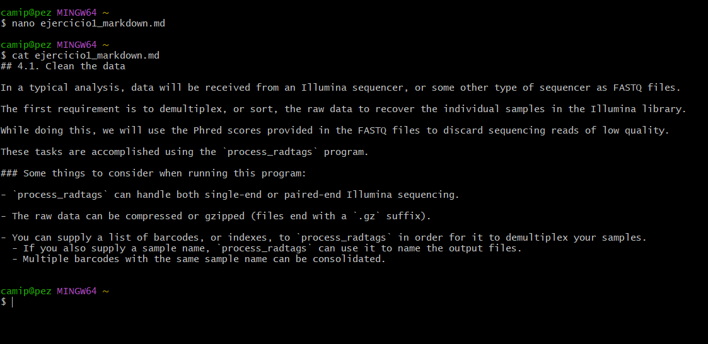

**Figura 1.** *Archivo `ejercicio1_markdown.md` creado con nano y verificado con `cat`, mostrando la
sintaxis Markdown utilizada.*

La Figura 2 corresponde a la sección original 4.1 "Clean the data" del manual de Stacks (Catchen,
s.f.), utilizada como texto de referencia. Al comparar ambas se observa que la jerarquía de
encabezados, el orden de los párrafos y los tres puntos de la lista fueron reproducidos
correctamente.

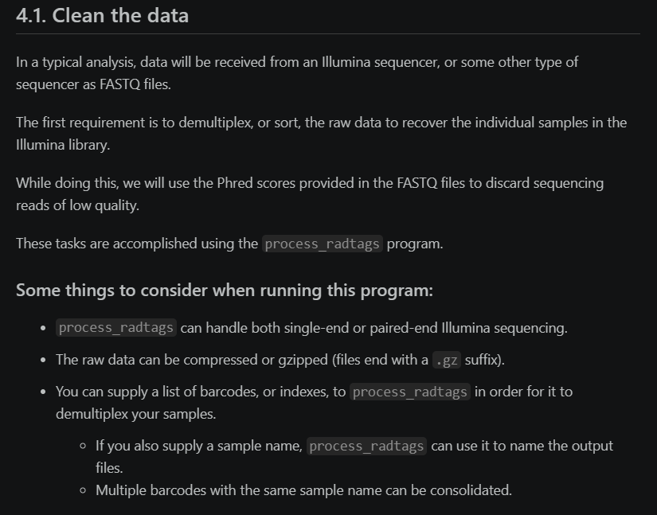

**Figura 2.** *Sección 4.1 "Clean the data" del manual de Stacks, empleada como texto de referencia
para reproducir en Markdown.*

La Figura 3 registra el primer *commit* del repositorio y la Figura 4 confirma que el archivo quedó
publicado y renderizado en GitHub.

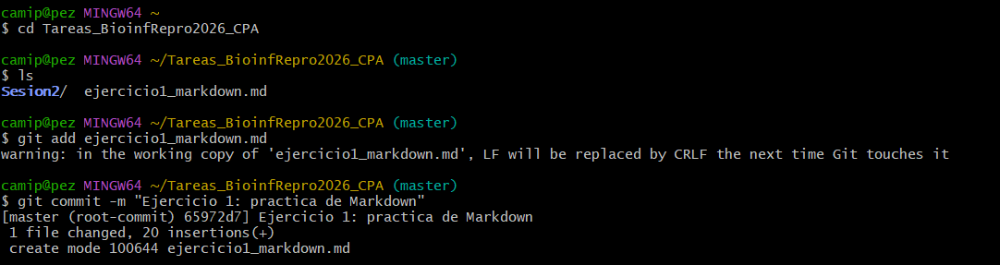

**Figura 3.** *Registro del archivo en el control de versiones mediante `git add` y `git commit`.*

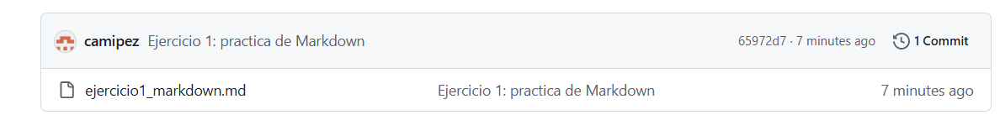

**Figura 4.** *Verificación en GitHub del archivo `ejercicio1_markdown.md`, correspondiente al primer
commit del repositorio.*

#### Conclusión

Markdown permite reproducir la estructura de un documento técnico con muy pocos caracteres de
marcado: el número de almohadillas define el nivel de encabezado, el guión inicial genera una viñeta
y las comillas invertidas distinguen el código del texto corrido. Al ser texto plano, el mismo
archivo puede versionarse con `git`, y GitHub lo renderiza automáticamente, lo que lo hace idóneo
para escribir los README que documentan un proyecto bioinformático.

---

### Actividad 2 — Creación del repositorio de tareas

> *Siguiendo los pasos del tutorial anterior, genera un repositorio dentro de tu cuenta de GitHub que
> se llame "Tareas_BioinfRepro2026_TusIniciales".*

#### Metodología

```bash
$ gh auth login
$ gh repo create Tareas_BioinfRepro2026_CPA --public --clone \
      --description "Tareas del curso BioinfinvRepro 2026"
$ cd Tareas_BioinfRepro2026_CPA
$ git remote -v
```

#### Resultados

La Figura 5 muestra la autenticación de GitHub CLI mediante un código de un solo uso
(`Logged in as camipez`) y la creación del repositorio `Tareas_BioinfRepro2026_CPA` con la opción
`--clone`, que crea el repositorio remoto y descarga la copia local en una sola operación. La salida
de `git remote -v` confirma que la copia local quedó vinculada al remoto `origin`.

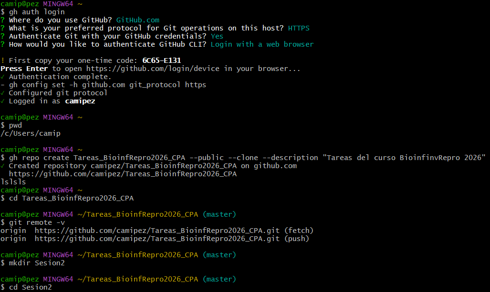

**Figura 5.** *Autenticación con `gh auth login`, creación del repositorio con
`gh repo create --public --clone` y verificación del remoto con `git remote -v`.*

#### Conclusión

GitHub CLI permite realizar desde la terminal operaciones que habitualmente se hacen por la interfaz
web, incluida la creación del repositorio y su vinculación automática con la copia local. Trabajar
de esta forma evita pasos manuales no documentados: cada acción queda escrita como un comando que
puede repetirse o compartirse, lo que es coherente con el principio de reproducibilidad que ordena
todo el curso.

---

### Actividad 3 — Clonar, modificar y documentar el repositorio del curso

> *Clona el repositorio de la clase y actualízalo cada vez que sea necesario. Clónalo en un lugar
> distinto de dónde habías bajado la carpeta del repo las clases anteriores; como el repo tiene más
> de una rama, agrega a tu `git clone` lo siguiente: `--branch master --single-branch`. Modifica la
> página de esta sesión en tu copia local, incluyendo tus datos (nombre y fecha de modificación),
> realiza un commit de tus cambios y toma un pantallazo de la página modificada y de la terminal
> luego de ejecutar `$ git status`, incluyendo esos pantallazos con sus explicaciones en tu
> repositorio personal.*

#### Metodología

```bash
# 1. Clonar el repositorio del curso en un directorio nuevo, solo la rama master
$ mkdir -p copiabioinfocurso
$ cd copiabioinfocurso
$ git clone https://github.com/u-genoma/BioinfinvRepro.git --branch master --single-branch
$ cd BioinfinvRepro/Unidad1/Sesion2

# 2. Modificar la página de la sesión y registrar el cambio
$ nano Sesion2_Organizacion_proyecto_bioinf.md
$ git add Sesion2_Organizacion_proyecto_bioinf.md
$ git commit -m "Agregue mi nombre y fecha a la pagina de la Sesion 2"
$ head Sesion2_Organizacion_proyecto_bioinf.md

# 3. Trasladar las capturas al repositorio personal y documentarlas
$ cd ~/Tareas_BioinfRepro2026_CPA/Tarea_1.2/ejercicio3/capturas
$ mv ~/OneDrive/Desktop/"Captura markdown.png" captura_pagina.png
$ mv ~/OneDrive/Desktop/"Terminal markdown.png" captura_terminal.png
$ nano ../ejercicio3_explicacion.md
$ git add . && git commit -m "Ejercicio 3: capturas de la modificacion del repo del curso"
$ git push
```

#### Resultados

La Figura 6 muestra la clonación del repositorio del curso en un directorio nuevo
(`copiabioinfocurso`), distinto al utilizado en clases anteriores, usando las opciones
`--branch master --single-branch`: se descargaron 3601 objetos y únicamente la rama `master`, y se
navegó hasta `Unidad1/Sesion2`.

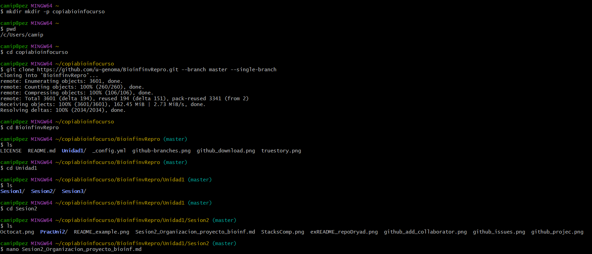

**Figura 6.** *Clonación del repositorio del curso con `--branch master --single-branch` en un
directorio nuevo y navegación hasta la carpeta de la Sesión 2.*

La Figura 7 presenta el archivo de la sesión abierto en `nano` durante la edición.

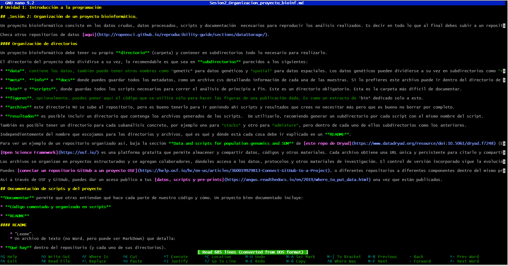

**Figura 7.** *Edición del archivo `Sesion2_Organizacion_proyecto_bioinf.md` en el editor nano dentro
de la copia local.*

La Figura 8 confirma el *commit* del cambio (un archivo modificado, dos inserciones y una
eliminación) y la salida de `head` deja ver la línea agregada: "Modificado por Camila Astorga el 31
de Agosto".

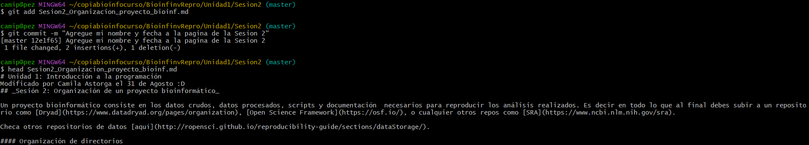

**Figura 8.** *Commit del cambio y verificación con `head` de la línea agregada con el nombre y la
fecha de modificación.*

Las Figuras 9 y 10 documentan el traslado y renombrado de las dos capturas hacia el repositorio
personal, la redacción del archivo explicativo y el *push* exitoso.

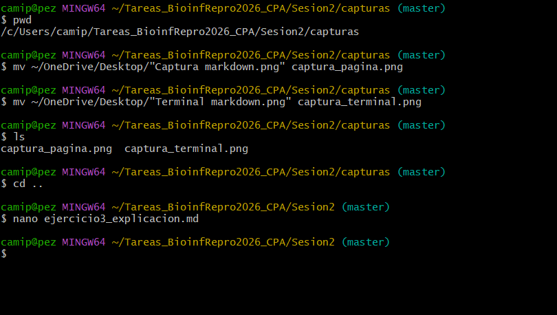

**Figura 9.** *Traslado y renombrado de las capturas de pantalla al subdirectorio de capturas del
repositorio personal.*

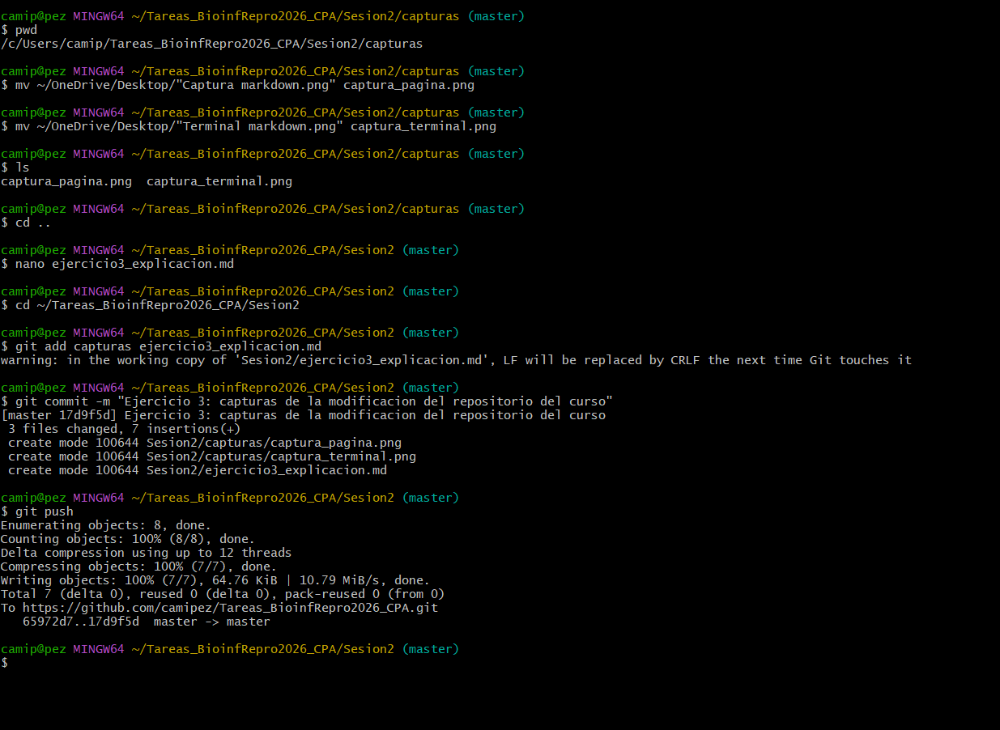

**Figura 10.** *Registro y publicación en GitHub de las capturas y del archivo
`ejercicio3_explicacion.md` mediante `git add`, `git commit` y `git push`.*

El detalle de qué muestra cada captura se encuentra en
[`ejercicio3/ejercicio3_explicacion.md`](ejercicio3/ejercicio3_explicacion.md).

#### Conclusión

La opción `--single-branch` descarga únicamente la rama de interés, lo que reduce el tamaño de la
copia y evita confusiones cuando el repositorio remoto tiene varias ramas. Clonar en un directorio
nuevo, en lugar de sobrescribir la carpeta anterior, protege el trabajo previo. Además, como no soy
propietaria del repositorio del curso, los *commits* quedan solo en la copia local y la evidencia
debe subirse al repositorio propio, lo que ilustra la diferencia práctica entre un *commit* (local)
y un *push* (remoto).

---

### Actividad 4 — Agregar colaborador desde la terminal

> *Agrégame a mí como colaborador en el repositorio de tareas del curso que creaste en tu cuenta de
> GitHub. Mi nombre de usuario es "ravuch".*

#### Metodología

```bash
$ gh api --method PUT \
      repos/camipez/Tareas_BioinfRepro2026_CPA/collaborators/ravuch \
      -f permission=push
```

#### Resultados

La Figura 11 muestra la respuesta en formato JSON devuelta por la API de GitHub tras ejecutar la
petición `PUT`. En ella se confirma la creación de la invitación (campo `id`), el repositorio
afectado (`camipez/Tareas_BioinfRepro2026_CPA`), el usuario invitado (`invitee: ravuch`), quien
envía la invitación (`inviter: camipez`) y el nivel de acceso otorgado (`permissions: write`). La
invitación queda en estado pendiente hasta que el usuario destinatario la acepte.

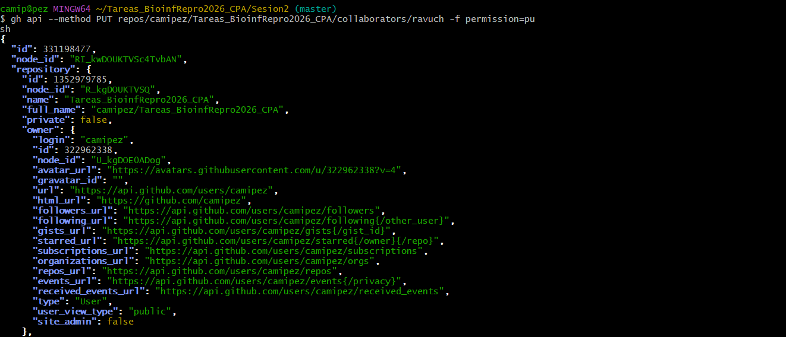

**Figura 11.** *Respuesta JSON de la API de GitHub confirmando la invitación de `ravuch` como
colaborador con permiso de escritura.*

#### Conclusión

Agregar colaboradores mediante `gh api` demuestra que las acciones administrativas de GitHub también
son accesibles de forma programática. La respuesta estructurada en JSON funciona como comprobante
verificable de la operación, algo que un clic en la interfaz web no deja registrado en el historial
de comandos.

---

### Actividad 5 — Análisis del script de Stacks

> *Mira el script tomado del manual de Stacks y contesta: 1) ¿Cuántos pasos tiene este script?
> 2) ¿Si quisieras correr este script y que funcionara en tu propio equipo, qué línea deberías
> cambiar y a qué? 3) ¿A qué equivale `$HOME`? 4) ¿Qué paso del análisis hace el programa `gsnap`?
> 5) ¿Qué hace en términos generales cada uno de los loops?*

#### Metodología

```bash
$ nano ejercicio5_respuestas.md
$ git add ejercicio5_respuestas.md
$ git commit -m "Ejercicio 5: analisis del script de Stacks"
$ git push

# Corrección posterior del formato Markdown
$ git pull                 # se produjo un conflicto de fusión
$ nano ejercicio5_respuestas.md
$ git add ejercicio5_respuestas.md
$ git commit -m "correcciones en ejercicio5_respuestas.md"
$ git push
```

#### Resultados

Las respuestas completas están en
[`ejercicio5/ejercicio5_respuestas.md`](ejercicio5/ejercicio5_respuestas.md) y se resumen a
continuación.

**1) Número de pasos.** El script tiene **cinco pasos**, delimitados por sus cinco bloques
comentados: (i) alinear con GSnap y convertir a BAM, (ii) correr `pstacks`, (iii) armar la lista de
muestras para `cstacks`, (iv) construir el catálogo con `cstacks` y parear cada muestra con
`sstacks`, y (v) calcular estadísticas poblacionales con `populations`.

**2) Línea a modificar.** La línea `src=$HOME/research/project`, porque define la carpeta base donde
el script busca los datos de entrada y escribe todos los resultados, y esa ruta no existe en otro
equipo. Adicionalmente habría que revisar la ruta de la base de datos del genoma en `gsnap` (`-D`),
los nombres de las muestras en `$files` y el número de procesadores (`-p 36` / `-t 36`) según los
núcleos disponibles.

**3) Equivalencia de `$HOME`.** Es una variable de ambiente definida por el sistema operativo que
contiene la ruta de la carpeta personal del usuario (en este equipo, `/c/Users/camip`); se comprueba
con `echo $HOME`.

**4) Función de `gsnap`.** Realiza el paso de **alineamiento**: toma las lecturas crudas (`.fq`) y
las alinea contra un genoma de referencia produciendo un archivo `.sam`, que luego se convierte a
`.bam` con `samtools`.

**5) Función de cada loop.**

| Loop | Función |
|---|---|
| 1 | Alinea cada muestra con `gsnap`, convierte el `.sam` a `.bam` y elimina el intermedio. |
| 2 | Corre `pstacks` sobre cada muestra, asignándole un identificador numérico creciente. |
| 3 | No analiza datos: concatena texto para armar la lista de flags `-s ruta` que recibirá `cstacks`. |
| 4 | Corre `sstacks` comparando cada muestra contra el catálogo ya construido. |

La Figura 12 muestra la creación del archivo de respuestas y su publicación en GitHub.

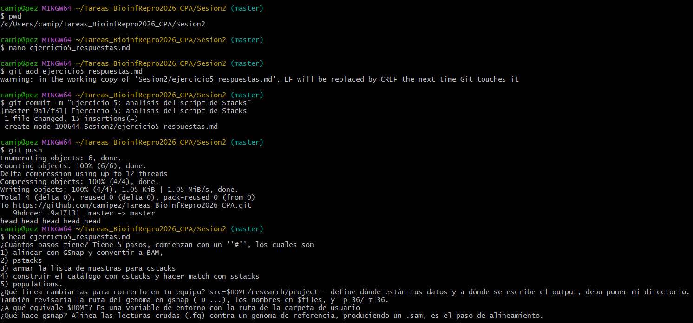

**Figura 12.** *Creación del archivo `ejercicio5_respuestas.md`, publicación en GitHub y verificación
de su contenido con `head`.*

Sin embargo, la Figura 13 evidencia un problema de presentación: al no dejar líneas en blanco entre
bloques, Markdown interpretó las preguntas 2 a 5 como un solo párrafo continuo, quedando el texto
ilegible.

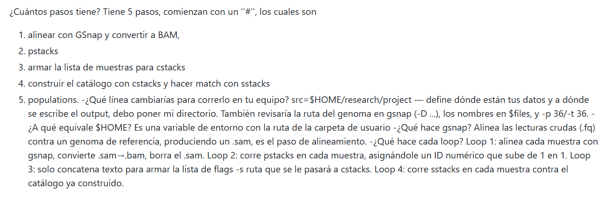

**Figura 13.** *Visualización defectuosa en GitHub: la falta de líneas en blanco fusiona las
respuestas 2 a 5 en un único párrafo.*

La Figura 14 documenta la corrección del archivo, que además requirió resolver un conflicto de
fusión generado al existir versiones distintas en local y en el remoto (estado `master|MERGING`).

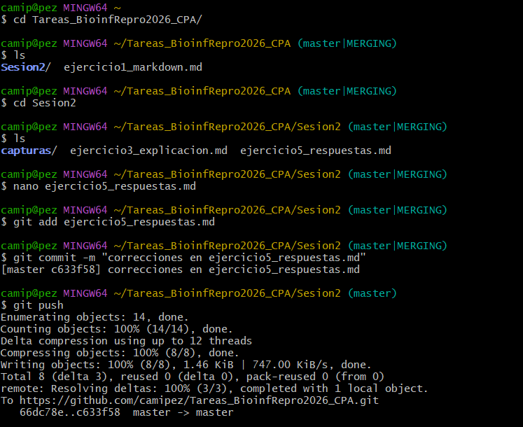

**Figura 14.** *Corrección del archivo, resolución del conflicto de fusión (`master|MERGING`) y
publicación de la versión corregida.*

La Figura 15 muestra el resultado final ya renderizado correctamente en GitHub, con cada pregunta en
negrita y sus respuestas separadas.

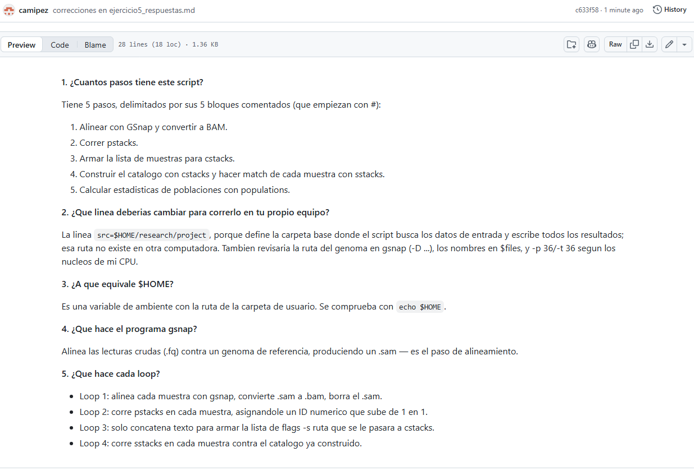

**Figura 15.** *Versión final del archivo `ejercicio5_respuestas.md` renderizada correctamente en
GitHub.*

#### Conclusión

La lectura del script confirma que un *pipeline* no es más que una secuencia ordenada de programas
donde la salida de uno alimenta al siguiente, y que sus loops permiten aplicar el mismo tratamiento
a todas las muestras sin repetir código. Desde el punto de vista de la documentación, el ejercicio
dejó una lección adicional, en Markdown la separación entre bloques mediante líneas en blanco no es
un detalle estético, sino la condición para que el contenido sea legible. El conflicto de fusión, por
su parte, mostró que `git` no realiza cambios de forma silenciosa, sino que exige una
decisión explícita del usuario.

---

### Actividad 6 — Modularización del pipeline

> *Retoma el ejercicio anterior y divídelo en un subscript para cada paso y un script maestro que
> corra toda la pipeline.*

#### Metodología

Siguiendo la organización de directorios propuesta en el material de la sesión, los scripts se
guardaron en el directorio `bin/`, con un archivo por paso y numeración que refleja el orden de
ejecución:

```
Tarea_1.2/bin/
├── config.sh              # variables compartidas por todo el pipeline
├── 01_alinear_gsnap.sh    # paso 1: alineamiento y conversión a BAM
├── 02_pstacks.sh          # paso 2: construcción de loci por muestra
├── 03_cstacks.sh          # paso 3: catálogo de loci
├── 04_sstacks.sh          # paso 4: pareo de muestras contra el catálogo
├── 05_populations.sh      # paso 5: estadísticas poblacionales
└── master_pipeline.sh     # script maestro que ejecuta los cinco pasos en orden
```

```bash
$ cd ~/Tareas_BioinfRepro2026_CPA/Tarea_1.2
$ mkdir bin && cd bin
$ nano config.sh
$ nano 01_alinear_gsnap.sh   # ... y así con cada paso
$ nano master_pipeline.sh
$ chmod +x *.sh
$ ls -la
```

El archivo `config.sh` centraliza las variables usadas por todos los subscripts, de modo que al
cambiar de equipo o de conjunto de datos solo hay que editar un archivo:

```bash
#!/bin/bash
export src=$HOME/research/project
export files="sample_01
sample_02
sample_03"
```

Cada subscript carga esas variables con `source` y ejecuta un único paso; por ejemplo,
[`bin/02_pstacks.sh`](bin/02_pstacks.sh):

```bash
#!/bin/bash
source "$(dirname "$0")/config.sh"

i=1
for file in $files
do
    pstacks -p 36 -t bam -m 3 -i "$i" -f "$src/aligned/${file}.bam" -o "$src/stacks/"
    let "i+=1"
done
```

Y el script maestro [`bin/master_pipeline.sh`](bin/master_pipeline.sh) invoca los cinco pasos en
orden.

#### Resultados

Las Figuras 16 y 17 muestran la creación del directorio `bin` y la escritura sucesiva de `config.sh`
y de los cinco subscripts numerados.

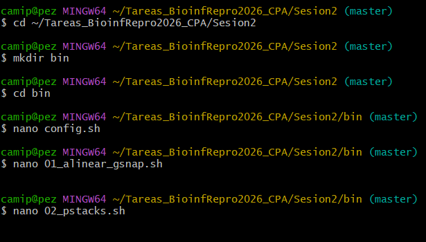

**Figura 16.** *Creación del directorio `bin` y escritura de `config.sh` y de los primeros subscripts
del pipeline.*

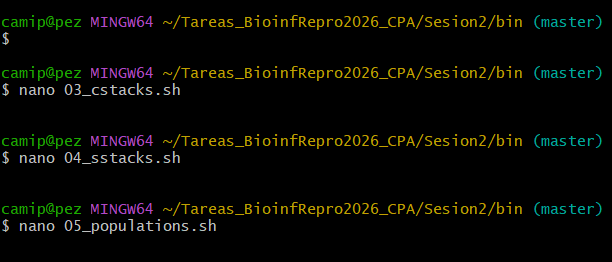

**Figura 17.** *Escritura de los subscripts correspondientes a `cstacks`, `sstacks` y `populations`.*

La Figura 18 documenta el cierre de la actividad: la creación del script maestro, la asignación de
permisos de ejecución con `chmod +x *.sh` y la verificación con `ls -la`, donde los siete archivos
aparecen con permisos `-rwxr-xr-x`. El *commit* final registra siete archivos nuevos y 72
inserciones, y el *push* confirma su publicación en el repositorio remoto.

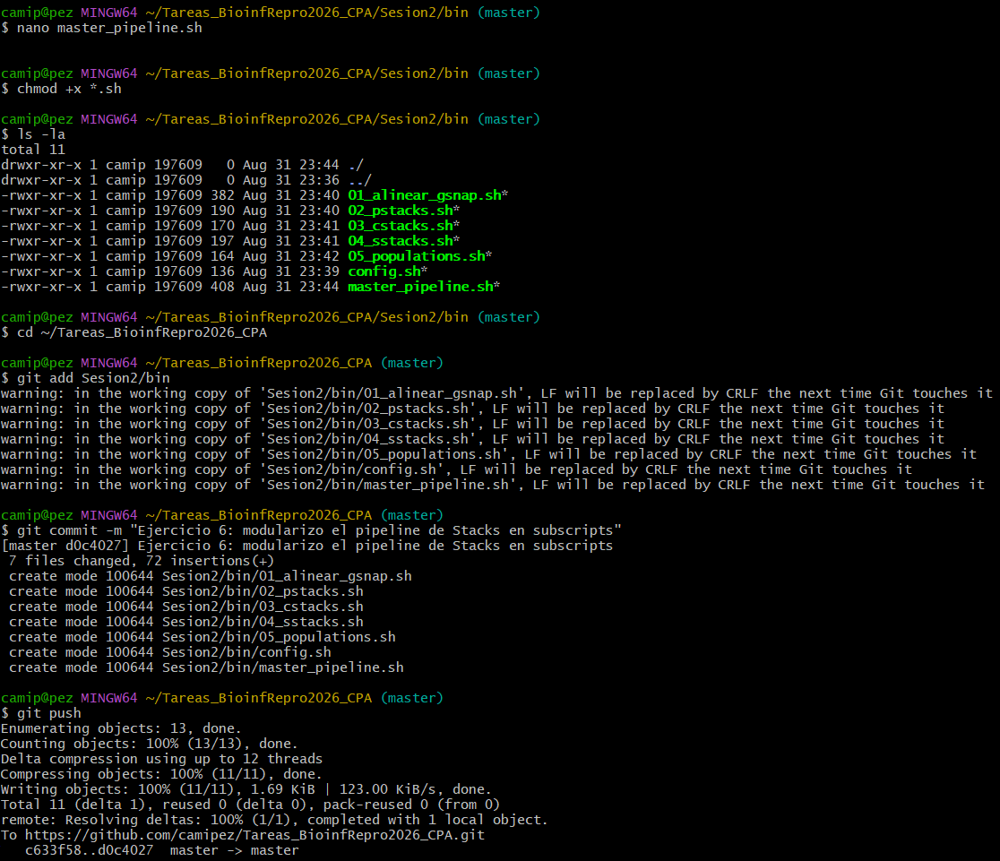

**Figura 18.** *Creación del script maestro, asignación de permisos de ejecución, verificación con
`ls -la` y publicación de los siete archivos en GitHub.*

Los scripts no se ejecutaron sobre datos reales porque el equipo no cuenta con los programas
`gsnap`, `samtools` ni la suite Stacks instalados; el objetivo de la actividad era la organización
modular del código.

#### Conclusión

Dividir el *pipeline* en subscripts independientes permite ejecutar, probar o repetir un paso
concreto sin volver a correr el análisis completo, y facilita localizar el origen de un error.
Centralizar las rutas y la lista de muestras en `config.sh` evita tener que editar cada archivo
cuando cambia el equipo o el conjunto de datos, mientras que el script maestro conserva la
trazabilidad del orden en que deben ejecutarse los pasos.

---


## Discusión

Antes de este curso, organizar un proyecto para mí se reducía a guardar todo en una sola carpeta,
muchas veces con nombres como "final" o "final_corregido". Con estos ejercicios entendí que eso no es
organización, sino acumulación y mala práctica, ya que no queda registro de qué cambió ni por qué.

La estructura que propone el material de la sesión "datos, metadatos, scripts en `bin` y
resultados, todo con un README" funciona como una bitácora de laboratorio para el trabajo
computacional, ya que cualquier persona, incluso yo misma en unos meses más, puede entender qué se hizo y en
qué orden sin preguntar. La Actividad 6, donde dividí un script largo en subscripts más pequeños y un
script maestro, fue donde más sentí ese cambio, pasar de un bloque difícil de revisar a piezas
identificables por su nombre y su orden.

Con `git` me pasó algo parecido. Al principio viví como un problema el conflicto de fusión que me
apareció en la Actividad 5, pero después entendí que era lo contrario  ya que tuve que decidir
qué versión guardar, obligándome a revisar y elegir manualmente, protegiendo mi trabajo de perderse
sin que me diera cuenta.

Esto conecta con algo que leí en el curso, una encuesta de *Nature* mostró que el 52 % de los
investigadores cree que existe una crisis de reproducibilidad, y más de la mitad ha tenido problemas
para reproducir sus propios experimentos (Baker, 2016). En mi experiencia con estos ejercicios tiene
sentido, casi todos mis errores no fueron de lógica, sino detalles pequeños, un espacio en un nombre
de archivo, una ruta mal escrita, una línea en blanco que faltaba. Eso me hace pensar que la
reproducibilidad depende tanto de entender los conceptos como de tener el hábito de trabajar de forma
ordenada y documentada.

---

## Conclusión general

El desarrollo de las seis actividades de la Sesión 2 permitió organizar y documentar un proyecto
bioinformático de principio a fin trabajando exclusivamente desde la terminal, se escribió
documentación en Markdown reproduciendo un texto de referencia, se creó y administró un repositorio
propio en GitHub mediante `git` y GitHub CLI, se clonó y modificó un repositorio remoto registran los cambios con *commits*, se gestionó la colaboración a través de la API de GitHub, se interpretó un
*pipeline* de Stacks identificando sus pasos y estructuras de control, y se reescribió ese *pipeline*
en forma modular con un script maestro. Todo el trabajo quedó publicado en el repositorio
`Tareas_BioinfRepro2026_CPA`, cuyo historial de *commits* constituye el registro reproducible del
proceso, cumpliendo así con el objetivo general y los objetivos específicos planteados al inicio del
informe.

---

## Referencias

1. Baker, M. (2016). 1,500 scientists lift the lid on reproducibility. *Nature, 533*(7604), 452–454.
   <https://doi.org/10.1038/533452a>
2. Catchen, J. (s.f.). *Stacks manual*. Catchen Lab, University of Illinois. Recuperado el 1 de
   septiembre de 2026, de <https://catchenlab.life.illinois.edu/stacks/manual/>
3. Catchen, J., Hohenlohe, P. A., Bassham, S., Amores, A., & Cresko, W. A. (2013). Stacks: An
   analysis tool set for population genomics. *Molecular Ecology, 22*(11), 3124–3140.
   <https://doi.org/10.1111/mec.12354>
4. Chacon, S., & Straub, B. (2014). *Pro Git* (2.ª ed.). Apress. <https://git-scm.com/book/en/v2>
5. GitHub. (s.f.). *GitHub CLI manual*. Recuperado el 1 de septiembre de 2026, de
   <https://cli.github.com/manual/>
6. u-genoma. (s.f.). *BioinfinvRepro — Unidad 1, Sesión 2: Organización de un proyecto
   bioinformático* [Repositorio de GitHub]. Recuperado el 1 de septiembre de 2026, de
   <https://github.com/u-genoma/BioinfinvRepro/blob/master/Unidad1/Sesion2/Sesion2_Organizacion_proyecto_bioinf.md>
