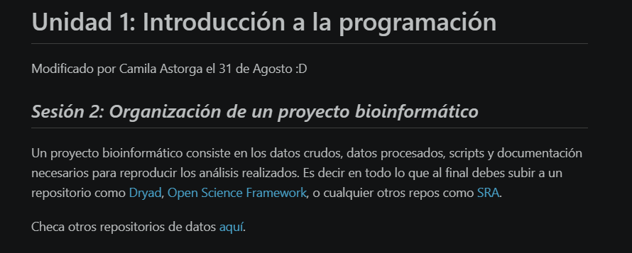
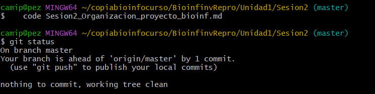

# Ejercicio 3 — Modificación del repositorio del curso

Este documento explica las dos capturas de pantalla solicitadas en el ejercicio, guardadas en
[`capturas/`](capturas/).

## Captura 1: página modificada

**Figura 1.** *Página `Sesion2_Organizacion_proyecto_bioinf.md` de la copia local del repositorio del
curso, visualizada con el Markdown renderizado. Se observa la línea agregada bajo el título con mi
nombre y la fecha de modificación: "Modificado por Camila Astorga el 31 de Agosto".*

## Captura 2: estado del repositorio

**Figura 2.** *Terminal después de ejecutar `git status` tras el commit del cambio. La salida
confirma que se está trabajando en la rama `master` y que el cambio quedó registrado en el control de
versiones.*

## Nota

El repositorio del curso (`u-genoma/BioinfinvRepro`) no admite `git push` desde mi cuenta porque no
soy colaboradora de él; por eso el commit queda únicamente en la copia local y la evidencia se
deposita en este repositorio personal.
