# Tarea 1.3 — Introducción a R

**Curso** Bioinformática e investigación reproducible para análisis genómicos
**Unidad 1** Introducción a la programación — Sesión 3
**Estudiante** Camila Astorga
**Profesor** Ricardo Verdugo
**Institución** Facultad de Ciencias Químicas y Farmacéuticas, Universidad de Chile
**Fecha** 23-09-26
**Repositorio** <https://github.com/camipez/Tareas_BioinfRepro2026_CPA>

---

## Objetivos

### Objetivo general

Practicar en R lo que vimos en la Sesión 3, usando la consola y RStudio, para aprender a manejar vectores, ciclos, funciones propias y datos reales que se usan en genómica.

### Objetivos específicos

- Crear variables y vectores en R, y sacar partes de ellos con corchetes.
- Escribir un ciclo for que recorra números y que se salte algunos cuando se le pida.
- Guardar los resultados de un ciclo en una tabla de dos columnas.
- Abrir un archivo externo con read.delim y mirar qué tiene adentro.
- Correr un script que ya estaba escrito y entender qué hace cada parte.
- Escribir una función propia que reciba datos y entregue un resultado.
- Modificar un análisis que ya existe para agregarle algo nuevo.
- Explorar una base de datos real y contestar preguntas sobre ella.
- Buscar un paquete de R que sirva para mi propio proyecto y explicar por qué lo elegí.

---

## Contenido de este directorio

| Ruta | Contenido |
|---|---|
| [`PracUni1Ses3/`](PracUni1Ses3/) | Datos y scripts copiados del repositorio del curso, usados en los Ejercicios 4, 6, 8 y 9. |
| [`figuras/`](figuras/) | Capturas citadas en este informe. |

---

## Desarrollo

### Ejercicio 1
>*Crea una variable con el logaritmo base 10 de 50 y súmalo a otra variable cuyo valor sea igual a 5.*

#### Metodología

```r
x <- log10(50)
y <- 5
resultado1 <- x + y
print(resultado1)
```

#### Resultados

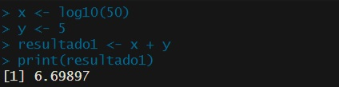

**Figura 1.** *La consola de R mostrando el resultado de sumar el logaritmo de 50 en base 10 con la variable y, resultado1 = 6.69897.*

#### Conclusión

log10 calcula directamente el logaritmo en base 10, sin tener que indicarle la base como argumento aparte. Guardar cada número en su propia variable, en vez de hacer todo en una sola línea, ayuda a entender después qué es cada cosa.

---

### Ejercicio 2
>*Suma el número 2 a todos los números entre 1 y 150.*

#### Metodología

```r
numeros <- 1:50
print(numeros)
resultado <- numeros + 2
print(resultado)
```

#### Resultados

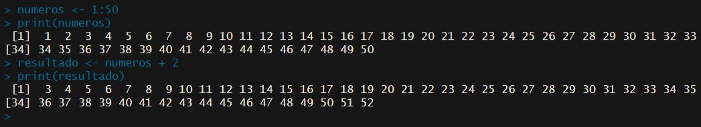

**Figura 2.** *La consola de R mostrando el vector con 2 sumado a cada número.*


#### Conclusión

En R se le puede sumar un número a un vector completo de una sola vez, sin tener que ir sumando número por número. El símbolo dos puntos es la forma más simple de armar una lista de números seguidos.

---

### Ejercicio 3
>*¿Cuántos números son mayores a 20 en el vector -13432:234?*

#### Metodología

```r
vector <- c(-13432:234)
sum(vector > 20)
```

#### Resultados

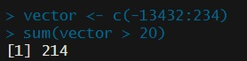

**Figura 3.** *La consola de R mostrando que 214 números del vector son mayores a 20.*

#### Conclusión

Cuando se compara un vector completo con un número, R devuelve una lista de verdadero o falso, uno por cada elemento. Sumar esa lista cuenta los verdaderos directamente, porque R los toma como si fueran el número 1, así que no hay que contar a mano.

---

### Ejercicio 4
>*Carga en R el archivo PracUni1Ses3/maices/meta/maizteocintle_SNP50k_meta_extended.txt y ponlo en un objeto de R llamado meta_maiz.*

#### Metodología

```r
getwd()
setwd("C:/Users/camip/BioinfinvRepro-master/Unidad1/BioinfinvRepro/Unidad1/Sesion3")
meta_maiz <- read.delim("PracUni1Ses3/maices/meta/maizteocintle_SNP50k_meta_extended.txt")
```

#### Resultados

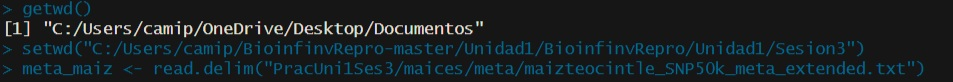

**Figura 4.** *La consola de R cargando el archivo de metadatos de maíz.*

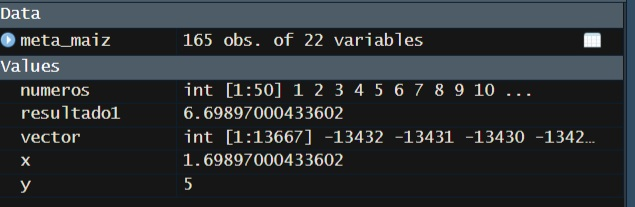

**Figura 5.** *El objeto meta_maiz en el panel Environment, con 165 observaciones de 22 variables.*

#### Conclusión

read.delim abre un archivo de texto separado por tabulaciones y lo deja listo como una tabla dentro de R, con cada columna del archivo convertida en una columna de esa tabla. Guardarlo en un objeto con nombre, en vez de solo mirarlo, permite usarlo de nuevo más adelante sin tener que abrirlo otra vez.

---

### Ejercicio 5
>*a) Escribe un for loop para que divida 35 entre 1:10 e imprima el resultado en la consola.*
>
>*b) Modifica el loop anterior para que haga las divisiones solo para los números nones, con un comando, no escribiendo c(1,3,...) a mano.*
>
>*c) Modifica el loop anterior para que los resultados de correr todo el loop se guarden en una data.frame de dos columnas, la primera con el texto resultado para x, donde x es cada elemento del loop, y la segunda con el resultado correspondiente a cada elemento del loop.*

#### Metodología

```r
# a) for loop básico
for (i in 1:10) {
  resultado <- 35/i
  print(paste("35/en", i, "es igual a", resultado))
}

# b) solo números nones, usando next
for (i in 1:10) {
  if (i %% 2 == 0) next
  print(35 / i)
}

# c) guardar resultados en una tabla de dos columnas
resultados <- data.frame(texto = character(0), valor = numeric(0))
for (i in 1:10) {
  if (i %% 2 == 0) next
  resultados <- rbind(resultados, data.frame(texto = paste("resultado para", i), valor = 35 / i))
}
```

#### Resultados

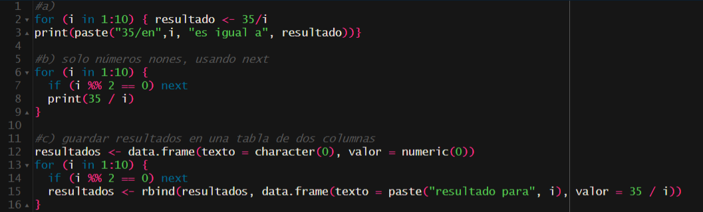

**Figura 5.** *La consola de R mostrando el ciclo básico y el ciclo con next para los números nones.*

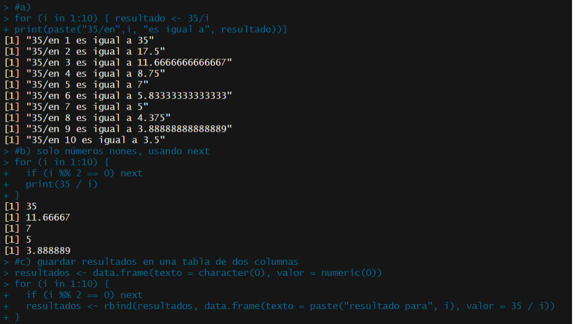

**Figura 6.** *El código completo de las tres partes del ejercicio en el editor.*

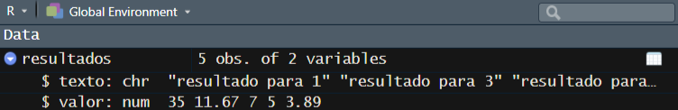

**Figura 7.** *El objeto resultados en el panel Environment, con 5 observaciones de 2 variables.*

#### Conclusión

La palabra next corta esa vuelta del ciclo y pasa directo a la siguiente, así que sirve para saltarse los números pares sin tener que armar antes una lista aparte solo con los nones. Armar la tabla vacía antes del ciclo y agregarle una fila nueva en cada vuelta con rbind deja todo ordenado, con el texto y el número juntos.

---

### Ejercicio 6
>*Abre en RStudio el script PracUni1Ses3/mantel/bin/1.IBR_testing.r y determina qué hacen los dos for loops del script, qué paquetes se necesitan para correrlo y qué archivos se necesitan para correrlo.*

#### Metodología

```r
setwd("PracUni1Ses3/mantel/bin")
source("1.IBR_testing.r")
```

El script hace un análisis de aislamiento por resistencia con datos de Fst calculados con ddRAD en Berberis alpina.

#### Resultados

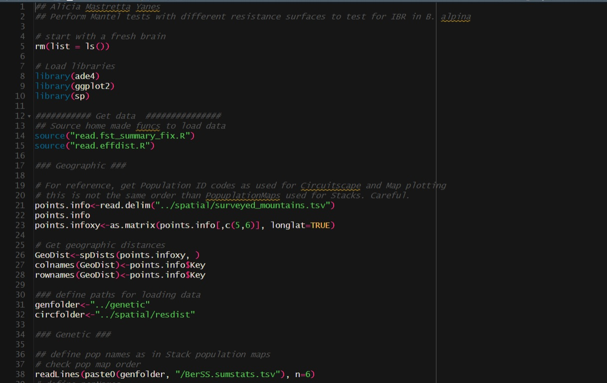

**Figura 8.** *El código fuente del script 1.IBR_testing.r abierto en RStudio, mostrando los paquetes y archivos que carga al principio.*

Qué hacen los loops. El primer for carga las matrices de distancia de cada escenario de paisaje y saca su promedio. El segundo for recorre esos mismos escenarios y le corre a cada uno un test de Mantel, guardando cada resultado en el objeto IBRresults.

Qué paquetes se necesitan. El script carga tres paquetes, ade4, ggplot2 y sp.

Qué archivos se necesitan. Además del script mismo, 1.IBR_testing.r, adentro se cargan otros dos scripts propios con source, read.fst_summary_fix.R y read.effdist.R, y un archivo de datos con las coordenadas de los puntos muestreados, surveyed_mountains.tsv, aparte de las matrices de distancia genética y de resistencia del paisaje que el script va cargando más adelante.

#### Conclusión

source corre un script completo, como si se hubiera escrito a mano en la consola, así que permite usar un análisis que ya está armado sin copiar todo el código de nuevo. Los dos ciclos de este script hacen cosas distintas, uno prepara los datos y el otro corre la prueba estadística, y tenerlos separados hace más fácil entender qué hace cada parte. También aprendí que un script así no funciona solo, necesita que R esté parado en la carpeta correcta para encontrar sus propios archivos de apoyo.

---

### Ejercicio 7
>*Escribe una función llamada calc.tetha que permita calcular tetha dados Ne y u como argumentos.*
>*Include the comment: Red banannas*


#### Metodología

```r
# Red banannas
calc.tetha <- function(Ne, u) {
  tetha <- 4 * Ne * u
  return(tetha)
}
```

#### Resultados

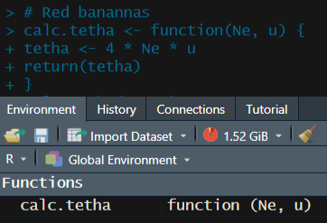

**Figura 9.** *La función calc.tetha ya creada, visible en el panel Environment bajo Functions.*

#### Conclusión

Escribir una función propia evita tener que escribir la misma cuenta cada vez que cambian los números, solo hay que llamar a la función con los valores nuevos. return deja claro cuál es el resultado que la función devuelve al final.

---

### Ejercicio 8
>*Al script del ejercicio de las pruebas de Mantel, agrega el código necesario para realizar un Partial Mantel test entre la matriz Fst y las matrices del presente y el LGM, >parcializando la matriz flat.*

>*Include the comment: Elefante blanco*

#### Metodología

```r
setwd("PracUni1Ses3/mantel/bin")
source("1.IBR_testing.r")
library(vegan)
ls()

# Elefante blanco

mantel.partial(Fst, present, flat)
mantel.partial(Fst, LGM, flat)
```

Fst, present, LGM y flat son los nombres de las matrices que usa el script, se confirman corriendo ls() después de cargarlo. La prueba se hace dos veces, comparando Fst contra el presente y Fst contra el LGM, descontando en las dos la matriz flat.

#### Resultados

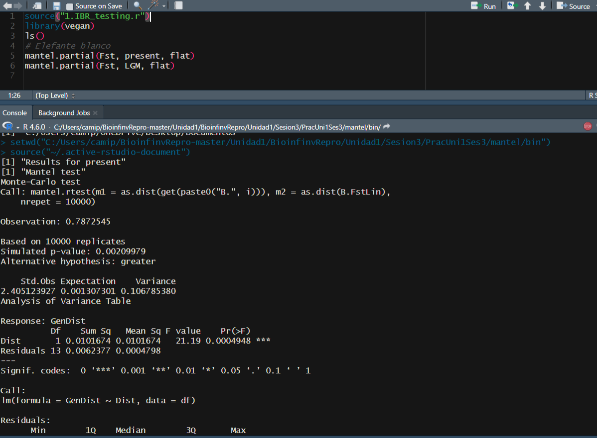

**Figura 10.** *La consola de R mostrando el resultado del test de Mantel parcial para el escenario present, con una observación de 0.7872545 y un p simulado de 0.00209979.*

#### Conclusión

Este test compara dos matrices de distancia pero descontando el efecto de una tercera, en este caso permite ver si la relación entre la genética y el paisaje se mantiene aunque se saque de en medio el efecto de la distancia geográfica normal. El resultado para el escenario present dio significativo, con un p menor a 0.05, así que la asociación no se explica solo por la distancia plana.

---

### Ejercicio 9
>*Escribe un script que debe estar guardado en PracUni1Ses3/maices/bin y llamarse ExplorandoMaiz.R, que cargue en R el archivo maizteocintle_SNP50k_meta_extended.txt y >responda, qué tipo de objeto se crea al cargar la base, cómo se ven las primeras 6 líneas del archivo, cuántas muestras hay, de cuántos estados se tienen muestras, cuántas >muestras fueron colectadas antes de 1980, cuántas muestras hay de cada raza, a qué altitud promedio fueron colectadas las muestras, a qué altitud máxima y mínima fueron >colectadas, crear una tabla nueva solo con las muestras de la raza Olotillo, crear una tabla nueva solo con las muestras de las razas Reventador, Jala y Ancho, y escribir >esa última tabla a un archivo llamado submat.cvs en la carpeta meta.*

#### Metodología

```r
getwd()

# 1) cargar el archivo de metadatos de maiz
meta_maiz <- read.delim("maizteocintle_SNP50k_meta_extended.txt")

# que tipo de objeto se crea al cargar la base
# se crea un data.frame

# como se ven las primeras 6 lineas
head(meta_maiz)

# cuantas muestras hay
nrow(meta_maiz)

# de cuantos estados se tienen muestras
length(unique(meta_maiz$Estado))

# cuantas muestras fueron colectadas antes de 1980
sum(meta_maiz$A.o._de_colecta < 1980, na.rm = TRUE)

# cuantas muestras hay de cada raza
table(meta_maiz$Raza)

# altitud promedio de colecta
mean(meta_maiz$Altitud, na.rm = TRUE)

# altitud maxima y minima de colecta
range(meta_maiz$Altitud, na.rm = TRUE)

# nueva tabla solo con las muestras de la raza Olotillo
olotillo <- meta_maiz[meta_maiz$Nombre_comun == "Olotillo", ]

# nueva tabla solo con las muestras de Reventador, Jala y Ancho
tres_razas <- meta_maiz[meta_maiz$Raza %in% c("Reventador", "Jala", "Ancho"), ]

# crear un cvs
write.csv(tres_razas, file = "C:/Users/camip/Tareas_BioinfRepro2026_CPA/Tarea_1.3/PracUni1Ses3/maices/meta/submat.cvs")
```


#### Resultados

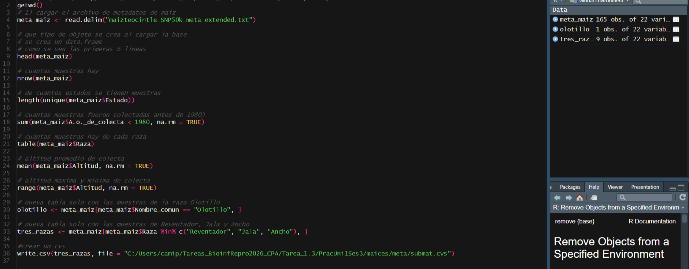

**Figura 11.** *El script completo en el editor, con el objeto meta_maiz de 165 observaciones y 22 variables ya cargado.*

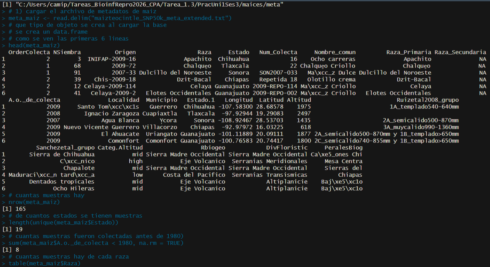

**Figura 12.** *La consola mostrando head(meta_maiz), con 165 muestras y 19 estados distintos.*

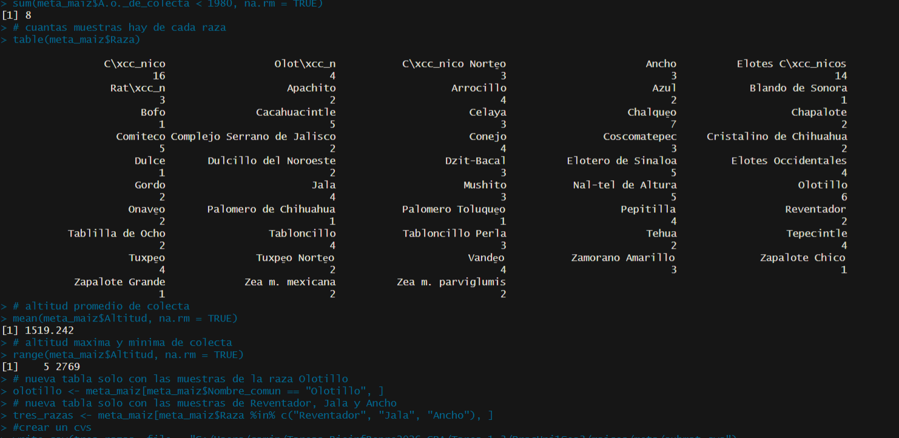

**Figura 13.** *La consola mostrando cuántas muestras fueron colectadas antes de 1980 (8), la tabla de muestras por raza, y la altitud promedio de colecta, 1519.242 metros, con un rango entre 5 y 2769 metros.*

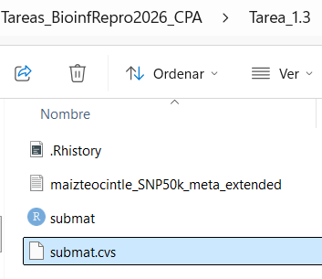

**Figura 14.** *El Explorador de Windows mostrando el archivo submat.cvs ya guardado dentro de la carpeta meta.*

#### Conclusión

Antes de meterse a analizar cualquier base de datos conviene mirar primero cuántas filas y columnas tiene, y qué valores hay en cada columna importante, porque un dato mal escrito o vacío se pilla altiro así, y no después de perder tiempo en un análisis que iba a salir mal igual. Separar además una parte de los datos, como las muestras de ciertas razas, y guardarla en su propio archivo, es lo que después permite trabajar solo con esa parte sin tener que filtrar de nuevo cada vez que se necesite.

---

### Ejercicio 10
>*Explorar los paquetes de R disponibles en CRAN y Bioconductor relacionados con el propio tipo de datos o análisis, elegir dos paquetes, indicar el nombre del paquete, la >URL, una descripción con palabras propias de qué hace el paquete y la razón por la que se eligió para el proyecto propio, documentándolo en el informe con un vínculo a una >página de la Wiki.*

#### Paquete 1, missMethyl

**URL** <https://bioconductor.org/packages/release/bioc/html/missMethyl.html>

missMethyl es un paquete que sirve para ver qué procesos biológicos aparecen relacionados cuando ya se tienen resultados de un array de metilación de Illumina. Lo importante es que corrige algo que podría engañar en estos datos, y es que no todos los genes tienen la misma cantidad de sondas en el array, entonces sin esa corrección un gen podría salir "importante" solo porque tiene más sondas, no porque de verdad esté pasando algo ahí.

Lo elegí porque lo uso en el pipeline de metilación que estoy armando para mi proyecto de exposición a pesticidas y Parkinson. Después de ver qué sondas cambian entre los grupos, missMethyl es el paso que ayuda a entender qué procesos biológicos podrían estar detrás de esos cambios, y hacerlo sin ese sesgo del número de sondas es importante para no sacar conclusiones equivocadas.

#### Paquete 2, DMRcate

**URL** <https://bioconductor.org/packages/release/bioc/html/DMRcate.html>

DMRcate busca regiones completas del genoma donde la metilación cambia, en vez de mirar sonda por sonda. Junta las sondas que están cerca entre sí y se fija si varias de ellas cambian juntas y en la misma dirección, en vez de solo un punto suelto que podría ser casualidad.

Lo elegí porque en mi proyecto una sola sonda que da distinta puede ser ruido, pero si toda una región cambia junta eso es una señal mucho más confiable para relacionar la exposición a pesticidas con cambios en el ADN. DMRcate deja pasar de mirar sonda por sonda a mirar regiones completas, que es más fácil de conectar con un gen concreto.

Descripción completa del pipeline en la página de la Wiki, [Notas Sesión 1.3][Sesion 1.3](../wiki/Sesion-1.3).

---

## Discusión

Los primeros ejercicios de esta sesión parecen simples porque son solo números sueltos, pero ahí es donde se entiende de verdad cómo piensa R. Lo que más me sirvió fue ver que R trabaja con vectores completos de una sola vez, sin tener que recorrer cada número a mano, y que una comparación como vector mayor a 20 no da un solo resultado sino una lista entera de verdadero y falso. Eso cambia la forma de escribir código, porque muchas cosas que uno haría con un ciclo se pueden hacer directo sobre el vector completo.

El ciclo for con next fue otro punto donde tuve que pensarlo dos veces, porque no bastaba con escribir el ciclo, había que decidir en qué caso saltarse una vuelta y en cuál seguir. Ahí quedó claro que un ciclo no es solo repetir lo mismo muchas veces, también sirve para decidir qué casos sí se procesan y cuáles no.

Pasar de trabajar con números inventados a abrir un archivo real, como el de los metadatos de maíz, o correr un script que ya estaba armado, como el del aislamiento por resistencia, fue un salto distinto. Ahí ya no alcanza con que el código corra, también hay que entender qué significa cada columna o cada resultado antes de decir algo sobre los datos, y hasta algo tan simple como en qué carpeta está parado R puede hacer que un script que sí funciona tire error solo porque no encuentra sus propios archivos de apoyo. Escribir mi propia función para calcular theta ayudó a unir todo esto, porque es la forma de guardar una cuenta que se va a repetir después, sin tener que escribirla de nuevo cada vez que cambian los números.

El Ejercicio 9 fue el que más se sintió como un análisis real y no como un ejercicio de práctica, porque no bastaba con correr un comando y listo, había que ir contestando pregunta por pregunta, contar muestras, revisar razas, sacar promedios, y al final quedarme solo con una parte de los datos y guardarla aparte. Ahí también me di cuenta de que algunas de esas preguntas necesitaban comandos que no estaban escritos tal cual en el tutorial, así que tuve que buscarlos por mi cuenta para poder responder exactamente lo que se pedía.

## Conclusión general

Esta sesión sirvió para pasar de usar R como una calculadora a empezar a programar de verdad en R, manejando vectores, ciclos, funciones propias y datos que vienen de afuera. Los ejercicios con números simples dejaron la base para entender cómo funciona un ciclo y cómo se guardan resultados en una tabla, y los ejercicios con datos reales, el archivo de maíz y el script de aislamiento por resistencia, mostraron cómo se usa eso mismo en un caso real de investigación. Buscar un paquete de R para mi propio proyecto al final de la tarea conectó directamente estos conceptos básicos con el trabajo de metilación y exposición a pesticidas que estoy desarrollando, dejando claro que estas herramientas simples de R son la base sobre la que se arma cualquier análisis más grande.

---

## Ejercicios de práctica, tipos de objetos en R base

Estos son ejercicios cortos que aparecen dentro del material de apoyo de la Sesión 3, Tipos_objetos_baseR.Rmd, no forman parte de la lista numerada de Ejercicio 1 a 10, así que quedan aparte, al final.

>1. *Crea un vector que contenga los números del 1 al 200 y los números del 300 al 450.*
>2. *Utiliza una sola línea de R para averiguar si el logaritmo base 10 de 20 es menor que la raíz cuadrada de 4.*
>3. *Crea un vector de caracteres con tres nombres de especies.*
>4. *Lee la ayuda de as.factor para determinar cómo crear un factor ordenado.*
>5. *Da un ejemplo de cómo convertir un vector integer a uno numérico.*
>6. *Muestra el valor del elemento de la segunda fila, tercera columna.*
>7. *Muestra las 2 primeras filas de la data.frame del ejercicio anterior.*

#### Metodología

```r
# 1) crea un vector que contenga los numeros del 1 al 200 y los numeros del 300 al 450
Vector <- c(1:200, 300:450)

# 2) utiliza una sola linea de R para averiguar si el logaritmo base de 10 de 20
# es menor que la raiz cuadrada de 4
log(20, base = 10) < sqrt(4)

# 3) crea un vector de caracteres con tres nombres de especies
especies <- c("perro", "gato", "mono")

# 4) lee la ayuda de as.factor para determinar como crear un factor "ordenado"
?as.factor()

# 5) da un ejemplo de como convertir un vector integer a uno numerico
x <- c(1L, 2L, 3L)
as.numeric(x)

# 6) muestra el valor del elemento de la segunda fila, tercera columna
x <- matrix(1:12, nrow = 4, ncol = 3)
x[2, 3]

# 7) muestra las 2 primeras filas de la data.frame del ejercicio anterior
x[1:2, ]
```

#### Resultados

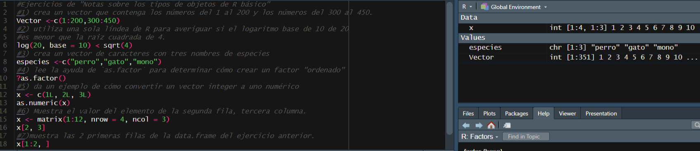

**Figura 15.** *El código de las siete prácticas en el editor de RStudio.*

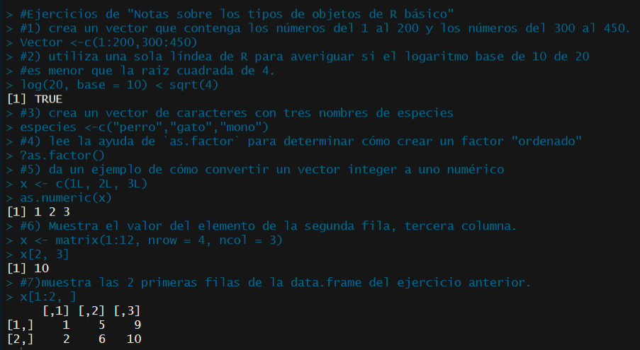

**Figura 16.** *La consola de R corriendo cada práctica en orden, con sus resultados.*


#### Conclusión

Estas prácticas cortas sirvieron para ver de cerca los distintos tipos de objetos que existen en R, vectores, factores, integers, matrices y data frames, y cómo se saca información de cada uno con corchetes. Fue útil confirmar que una comparación lógica se puede resolver en una sola línea, y que el mismo símbolo de corchetes cambia de significado según si el objeto tiene una dimensión, como un vector, o dos, como una matriz o una data.frame.

---

## Referencias

1. u-genoma. (s.f.). *BioinfinvRepro — Unidad 1, Sesión 3, Introducción a R* [Repositorio de GitHub]. Recuperado el 15 de Septiembre del 2026, de <https://github.com/u-genoma/BioinfinvRepro/blob/master/Unidad1/Sesion3/Sesion3_Intro_a_R.md>
2. u-genoma. (s.f.). *BioinfinvRepro — Unidad 1, Sesión 3, Tipos de objetos en R base* [Repositorio de GitHub]. Recuperado el 15 de Sepriembre del 2026, de <https://github.com/u-genoma/BioinfinvRepro/blob/master/Unidad1/Sesion3/Tipos_objetos_baseR.Rmd>
