# Tarea 2.1 — Control de calidad de lecturas NGS

**Curso** Bioinformática e investigación reproducible para análisis genómicos
**Unidad 2** Control de calidad de datos NGS — Sesión 4
**Estudiante** Camila Astorga
**Profesor** Ricardo Verdugo
**Institución** Facultad de Ciencias Químicas y Farmacéuticas, Universidad de Chile
**Fecha** 30-09-26
**Muestra** S11 (lecturas pareadas R1/R2, datos crudos ubicados en `181004_curso_calidad_datos_NGS/fastq_raw/`)
**Repositorio** <https://github.com/camipez/Tareas_BioinfRepro2026_CPA>

---

## Objetivos

### Objetivo general

Realizar el control de calidad de las lecturas de secuenciación NGS de la muestra S11 (R1 y R2), combinando comandos Unix y el programa FastQC, para aprender a leer e interpretar los indicadores de calidad de una corrida de secuenciación.

### Objetivos específicos

- Explorar un archivo fastq crudo usando comandos Unix (contar lecturas, previsualizar líneas, identificar una lectura completa).
- Traducir manualmente el código de calidad (Phred) de una lectura a valores numéricos.
- Explorar el archivo de regiones blanco (`regiones_blanco.bed`) del panel usado en la corrida.
- Generar un informe de calidad con FastQC para R1 y R2 de la muestra asignada.
- Descargar los informes al computador local vía `scp`.
- Analizar el informe de calidad e interpretar sus módulos principales.
- Comparar los valores calculados manualmente con los reportados por FastQC.
- Seleccionar las figuras más relevantes del informe e interpretarlas.

---

## Contenido de este directorio

| Ruta | Contenido |
|---|---|
| [`figuras/`](figuras/) | Capturas de terminal y gráficos citados en este informe. |
| [`S11_R1_fastqc.html`](S11_R1_fastqc.html) | Informe completo de FastQC para R1, generado en el servidor del curso. |
| [`S11_R2_fastqc.html`](S11_R2_fastqc.html) | Informe completo de FastQC para R2, generado en el servidor del curso. |

---

## Desarrollo

### Conexión al servidor y configuración inicial

Antes de partir con los ejercicios, me conecté al servidor del curso por `ssh -Y`, creé mi carpeta personal de trabajo (`mkdir castorga`) y probé que FastQC funcionara corriéndolo sobre una muestra (S3) que todavía no era la mía definitiva, antes de correr la muestra que elegí, la S11.

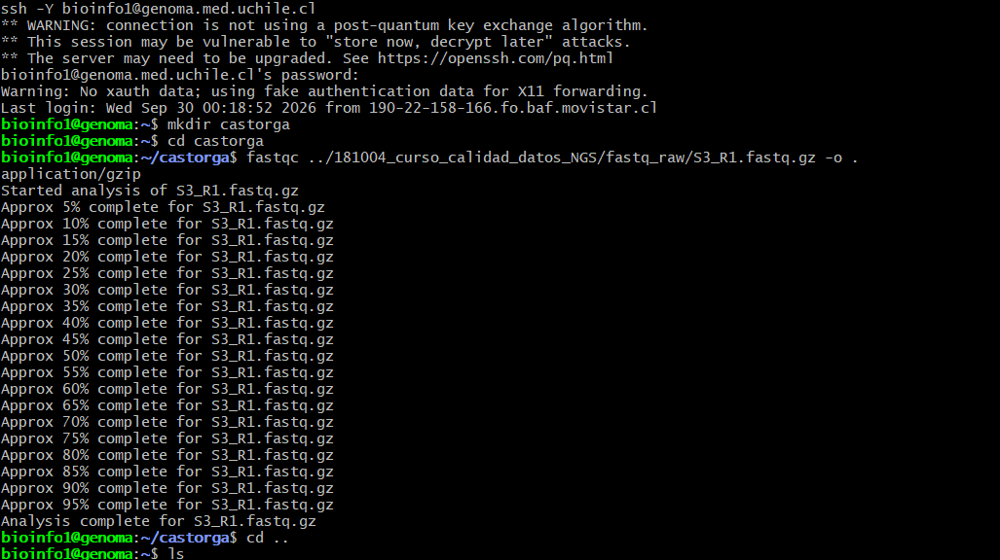

**Figura 1.** *Conexión al servidor vía SSH, creación de la carpeta de trabajo `castorga` y primera corrida de prueba de FastQC (sobre la muestra S3, previo a confirmar la muestra S11 como la asignada).*

---

### Ejercicio 1 — Comandos Unix sobre el archivo fastq

> Usando comandos Unix:
> - Contar el número de lecturas (reads) en un archivo fastq
> - Previsualizar las primeras 40 líneas del mismo archivo fastq
> - Ubicar la lectura 3 e identificar la información disponible. Describir en detalle la información entregada. ¿Donde se entrega la calidad del read?, ¿Cuál es el ID (identificador) del read? Etc. Utilice fechas y etiquetas para identificar cada parte.
> - Traducir el código de calidad para las primeras 10 bases del tercer read a valores numéricos (Q) usando la codificación entregada en clase.
> - Determinar el número de regiones blanco en el panel, analizando el archivo `regiones_blanco.bed`
> - Genere una lista de símbolos de genes encestados (solo valores distintos)
> - Cuente cuántos genes hay en la lista

#### 1.1 Conteo de lecturas y previsualización

##### Metodología

```bash
zcat ../181004_curso_calidad_datos_NGS/fastq_raw/S11_R1.fastq.gz | wc -l
echo $(zcat ../181004_curso_calidad_datos_NGS/fastq_raw/S11_R1.fastq.gz | wc -l)/4 | bc
zcat ../181004_curso_calidad_datos_NGS/fastq_raw/S11_R1.fastq.gz | head -40
```

##### Resultados

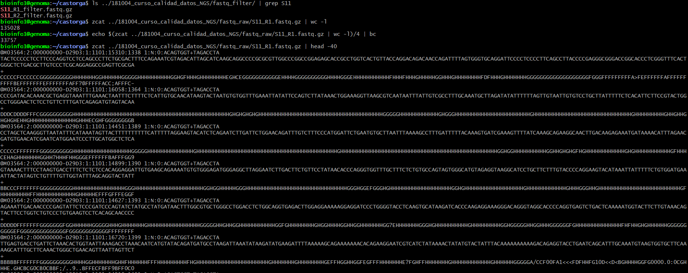

**Figura 2.** *Conteo de líneas del archivo (135028), división por 4 para obtener el número de lecturas (33757) y previsualización de las primeras 40 líneas (10 lecturas completas) de `S11_R1.fastq.gz`. También se muestra que existen versiones podadas de la muestra (`S11_R1_filter.fastq.gz`, `S11_R2_filter.fastq.gz`) en la carpeta `fastq_filter/`.*

El archivo `S11_R1.fastq.gz` tiene 135.028 líneas, que corresponden a 33.757 lecturas (cada lectura ocupa 4 líneas en formato fastq).

#### 1.2 Identificación de la lectura 3

##### Metodología

```bash
zcat ../181004_curso_calidad_datos_NGS/fastq_raw/S11_R1.fastq.gz | head -12 | tail -4
```

##### Resultados

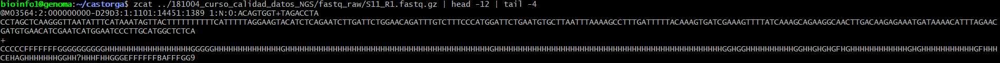

**Figura 3.** *Las 4 líneas correspondientes a la lectura 3 de `S11_R1.fastq.gz`.*

La lectura 3 tiene las siguientes 4 líneas, cada una con su propia función dentro del formato fastq:

1. **Línea de identificador (ID)**, comienza con `@`: `@M03564:2:000000000-D29D3:1:1101:14451:1389 1:N:0:ACAGTGGT+TAGACCTA`. Contiene el instrumento (`M03564`), número de corrida, ID de la celda de flujo (`D29D3`), carril, y coordenadas del cluster en la celda (tile, x, y), además de si la lectura es R1 o R2 (`1:N:0:...`) y el índice de secuenciación usado.
2. **Línea de secuencia**: la secuencia de nucleótidos leída (251 bases), ej. `CCTAGCTCAAGGGTTAATATTTCATAAATAGTTACT...`.
3. **Línea separadora**, comienza con `+`: en este caso solo tiene el símbolo `+`, sin repetir el ID.
4. **Línea de calidad**: una cadena de 251 caracteres (misma longitud que la secuencia), donde cada carácter codifica, en formato Phred+33 (ASCII), qué tan confiable es la base correspondiente de la línea 2. Es decir, la calidad del read se entrega en esta cuarta línea, un carácter por cada base de la secuencia.

#### 1.3 Traducción del código de calidad (Phred)

##### Metodología

```bash
python3 -c "s='CCCCCFFFFF'; print([ord(c)-33 for c in s])"
```

##### Resultados

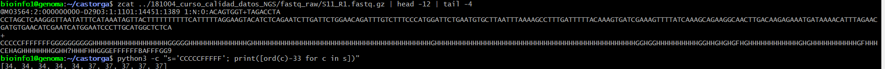

**Figura 4.** *Traducción de los primeros 10 caracteres de calidad de la lectura 3 (`CCCCCFFFFF`) a valores Q, restando 33 al código ASCII de cada carácter (codificación Phred+33 / Sanger).*

Los valores Q obtenidos para las primeras 10 bases son: `34, 34, 34, 34, 34, 37, 37, 37, 37, 37`. Todos corresponden a una probabilidad de error muy baja (Q34 ≈ 1 en 2.500 bases , Q37 ≈ 1 en 5.000), es decir, bases de muy buena calidad, como vimos en clase  10^(-34/10)=0.0003981072.

#### 1.4 Regiones blanco del panel

##### Metodología

```bash
cat ../181004_curso_calidad_datos_NGS/regiones_blanco.bed
```

##### Resultados

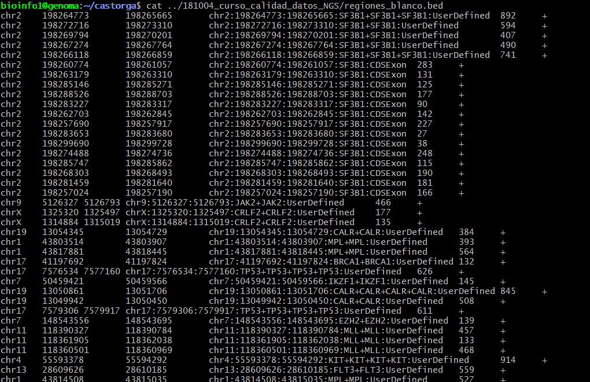

**Figura 5.** *Vista parcial del archivo `regiones_blanco.bed`, con columnas cromosoma, inicio, fin, nombre de la región (que incluye coordenadas, gen y tipo de región), score y hebra.*

El archivo `regiones_blanco.bed` sigue el formato BED estándar (columnas separadas por tabulación), cromosoma, posición de inicio, posición de fin, nombre/anotación de la región, score y hebra. La columna 4 (nombre) es un texto compuesto que incluye la posición, el o los genes involucrados y el tipo de región.

#### 1.5 Lista de genes distintos y conteo

##### Metodología

```bash
cut -f4 ../181004_curso_calidad_datos_NGS/regiones_blanco.bed | sort -u
cut -f4 ../181004_curso_calidad_datos_NGS/regiones_blanco.bed | sort -u | wc -l
```

##### Resultados

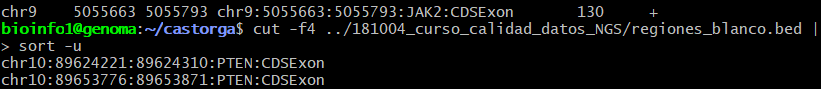

**Figura 6.** *Vista parcial de la lista de valores distintos (`sort -u`) de la columna 4 del archivo `regiones_blanco.bed`.*

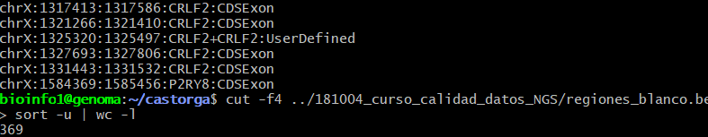

**Figura 7.** *Conteo de valores distintos de la columna 4: 369.*

Con `cut -f4 | sort -u | wc -l` obtuve **369** valores distintos en la columna 4 del archivo. Es importante aclarar que esta columna no contiene solo el símbolo del gen, sino el texto completo `cromosoma:inicio:fin:gen:tipo` (por ejemplo `chr10:89624221:89624310:PTEN:CDSExon`), por lo que 369 corresponde al número de **regiones anotadas distintas** del panel, no directamente al número de genes distintos (un mismo gen, como `PTEN` o `CRLF2`, aparece en varias regiones con distintas coordenadas).

Para acercarme a una lista de solo símbolos de gen, agregué un `cut` extra que corta el texto de la columna 4 usando `:` como separador y se queda con el campo 4 (el gen), antes de aplicar `sort -u`:

```bash
cut -f4 ../181004_curso_calidad_datos_NGS/regiones_blanco.bed | cut -d: -f4 | sort -u
cut -f4 ../181004_curso_calidad_datos_NGS/regiones_blanco.bed | cut -d: -f4 | sort -u | wc -l
```

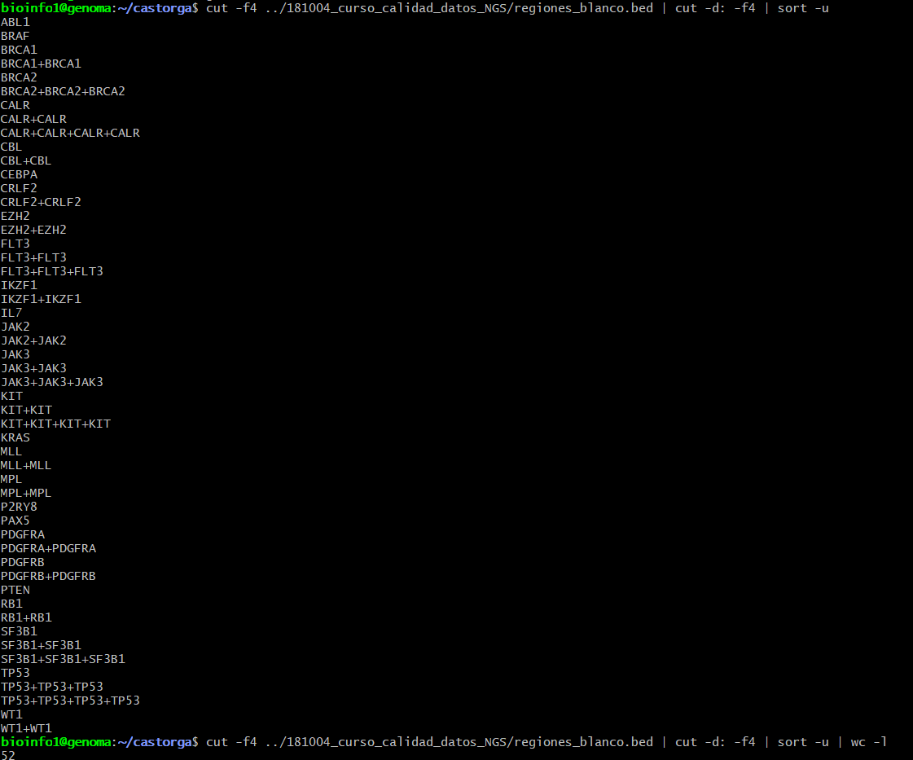

**Figura 7.1** *Lista de valores distintos de la parte "gen" de la columna 4, y su conteo: 52.*

Este segundo intento da **52** valores distintos, entre ellos ABL1, BRAF, BRCA1, BRCA2, CALR, CBL, CEBPA, CRLF2, EZH2, FLT3, IKZF1, IL7, JAK2, JAK3, KIT, KRAS, MLL, MPL, P2RY8, PAX5, PDGFRA, PDGFRB, PTEN, RB1, SF3B1, TP53 y WT1. Aun así, esto tampoco es 100% el número real de genes distintos, cuando una región cubre el mismo gen más de una vez, el archivo lo anota repetido y unido con `+` (por ejemplo `BRCA1`, `BRCA1+BRCA1` y `BRCA1+BRCA1+BRCA1` aparecen como tres valores distintos para `sort -u`, aunque las tres son el mismo gen). Contando a mano los símbolos únicos que aparecen en la lista (sin importar cuántas veces se repiten con `+`), el número real de genes distintos es 27. 

---

### Ejercicio 2 — Informe de calidad con FastQC

> Genere un informe de calidad con FastQC para una muestra, para R1 y R2.

#### Metodología

```bash
fastqc ../181004_curso_calidad_datos_NGS/fastq_raw/S11_R1.fastq.gz -o .
fastqc ../181004_curso_calidad_datos_NGS/fastq_raw/S11_R2.fastq.gz -o .
```

#### Resultados

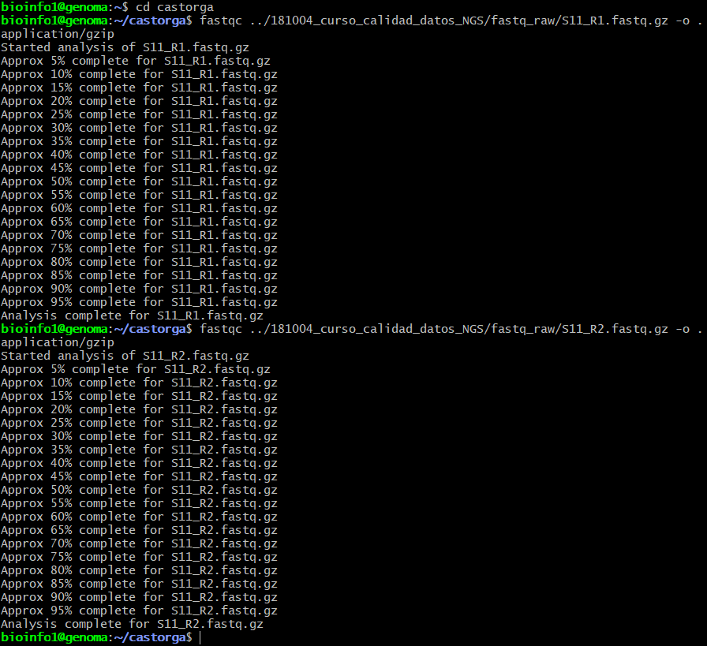

**Figura 8.** *Corrida de FastQC sobre `S11_R1.fastq.gz` y `S11_R2.fastq.gz`, generando los archivos `S11_R1_fastqc.html`, `S11_R1_fastqc.zip`, `S11_R2_fastqc.html` y `S11_R2_fastqc.zip` en mi carpeta personal del servidor.*

#### Conclusión

El flag `-o .` es importante porque indica que los archivos de salida deben quedar en la carpeta actual; si se omite, FastQC los deja en la misma carpeta que el archivo fastq de entrada (en este caso, una carpeta compartida donde no tengo permiso de escritura).

---

### Ejercicio 3 — Descarga de los informes al computador local

> Baje los archivos HTML a su computador mediante sftp (puede usar cualquier cliente o la línea de comandos. Por ejemplo, ejecutando desde su computador local: `scp bioinfo1@genoma.med.uchile.cl:ricardo/S3_R1_fastqc* .`

#### Metodología

```bash
scp bioinfo1@genoma.med.uchile.cl:castorga/S11_R1_fastqc* .
scp bioinfo1@genoma.med.uchile.cl:castorga/S11_R2_fastqc* .
```

#### Resultados

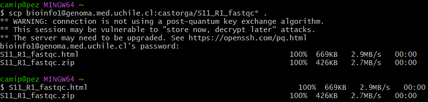

**Figura 9.** *Descarga exitosa de `S11_R1_fastqc.html` y `S11_R1_fastqc.zip` vía `scp`, ejecutado desde una terminal local.*

Los dos archivos HTML (R1 y R2) quedaron descargados en mi computador y son los que se analizan en los ejercicios siguientes.

#### Conclusión

El primer intento de descarga falló repetidamente con error "No route to host" porque estaba ejecutando `scp` desde dentro de la sesión SSH activa en el servidor, en vez de hacerlo desde una terminal local nueva. `scp` se ejecuta desde el computador de origen (local), no desde el servidor remoto.

---

### Ejercicio 4 — Análisis del informe de calidad (R1 y R2)

> Analice el informe de calidad creado con fastqc para las lecturas R1 y R2.

#### Metodología

Se abrieron los archivos `S11_R1_fastqc.html` y `S11_R2_fastqc.html` y se revisó la tabla de "Basic Statistics" y el resumen de módulos (columna de íconos verde/amarillo/rojo a la izquierda del informe).

#### Resultados

**Basic Statistics (idéntica para R1 y R2):**

| Métrica | Valor |
|---|---|
| Encoding | Sanger / Illumina 1.9 |
| Total Sequences | 33.757 |
| Total Bases | 8,4 Mbp |
| Sequences flagged as poor quality | 0 |
| Sequence length | 251 |
| %GC | 45 |

**Resumen de módulos:**

| Módulo | R1 | R2 |
|---|---|---|
| Per base sequence quality |  Pass |  Warning |
| Per tile sequence quality |  Pass |  Pass |
| Per sequence quality scores |  Pass |  Pass |
| Per base sequence content |  Pass |  Fail |
| Per sequence GC content |  Fail |  Fail |
| Per base N content |  Pass |  Pass |
| Sequence Length Distribution |  Pass |  Pass |
| Sequence Duplication Levels |  Fail |  Fail |
| Overrepresented sequences |  Warning |  Warning |
| Adapter Content |  Pass |  Fail |

#### Conclusión

R1 y R2 tienen el mismo número de lecturas (33.757) y la misma longitud (251 pb), como corresponde a lecturas pareadas. R2 tiene más módulos en amarillo/rojo que R1 (calidad por base marcada en amarillo, y contenido por base y contenido de adaptadores marcados en rojo), lo que es un patrón esperado en secuenciación Illumina: la segunda lectura (R2) suele tener algo más de ruido que la primera (R1). El "Fail" en GC content y en niveles de duplicación en ambas lecturas es consistente con tratarse de un panel dirigido (regiones blanco específicas), donde se espera mayor duplicación y una distribución de GC distinta a la de un genoma completo, no necesariamente un problema de calidad de la corrida en sí.

---

### Ejercicio 5 — Comparación entre valores calculados manualmente y FastQC

> Compare los valores calculados en el punto 1 con lo entregado en el informe de calidad obtenido con FastQC

#### Resultados

| Valor | Calculado manualmente  | Reportado por FastQC |
|---|---|---|
| Número de lecturas (R1) | 33.757 (`wc -l`/4) | 33.757 (Total Sequences) |
| Largo de lectura | 251 pb (contando la secuencia de la lectura 3) | 251 (Sequence length) |
| Codificación de calidad | (Q34 ≈ 1 en 2.500 bases , Q37 ≈ 1 en 5.000) | Equivalente |

#### Conclusión

Los tres valores calculados a mano coinciden exactamente con lo que reporta FastQC, lo que confirma que el conteo manual de lecturas (dividir las líneas del fastq por 4) y el supuesto de codificación Phred+33 usado para traducir la calidad de la lectura 3 fueron correctos.

---

### Ejercicio 6 — Selección de las 4 figuras más importantes

> Seleccione las 4 figuras más importantes a su criterio para analizar la calidad de la corrida, cópielas a un archivo Markdown en su repositorio y agregue su interpretación de cada figura. Recuerde hacer la comparación de R1 y R2 para las secuencias crudas y las secuencias podadas.

Elegí el módulo **Per base sequence quality** y el módulo **Per sequence quality scores**, para R1 y para R2, por ser los dos indicadores que primero se revisan para juzgar si una corrida sirve o no, el primero muestra cómo cae la calidad a lo largo del largo de la lectura, y el segundo resume la calidad promedio de todas las lecturas en un solo gráfico. Se repitieron para las secuencias crudas y para las podadas, tal como pide el enunciado.

##### Metodología (secuencias podadas)

Para completar la comparación, corrí FastQC también sobre los archivos podados de la muestra (ubicados en `fastq_filter/` en vez de `fastq_raw/`) y descargué los reportes de la misma forma que las crudas:

```bash
fastqc ../181004_curso_calidad_datos_NGS/fastq_filter/S11_R1_filter.fastq.gz -o .
fastqc ../181004_curso_calidad_datos_NGS/fastq_filter/S11_R2_filter.fastq.gz -o .
```

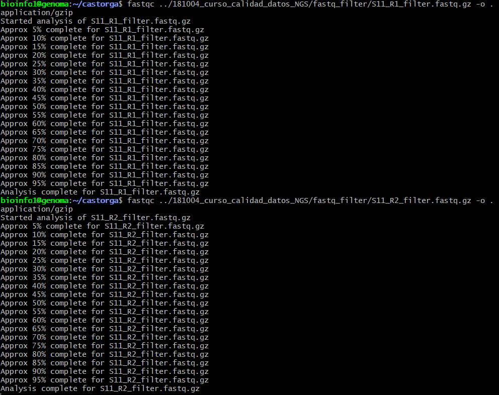

**Figura 14.1** *FastQC corriendo sobre `S11_R1_filter.fastq.gz` y `S11_R2_filter.fastq.gz`.*

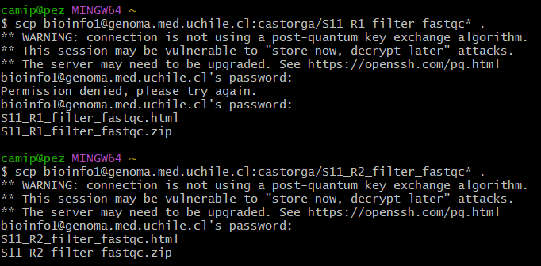

**Figura 14.2** *Descarga de los 4 archivos (`S11_R1_filter_fastqc.html/.zip`, `S11_R2_filter_fastqc.html/.zip`) vía `scp`, desde la terminal local. El primer intento con R1 dio "Permission denied" por un error al escribir la contraseña; se repitió el comando y funcionó.*

##### Resultados — datos crudos

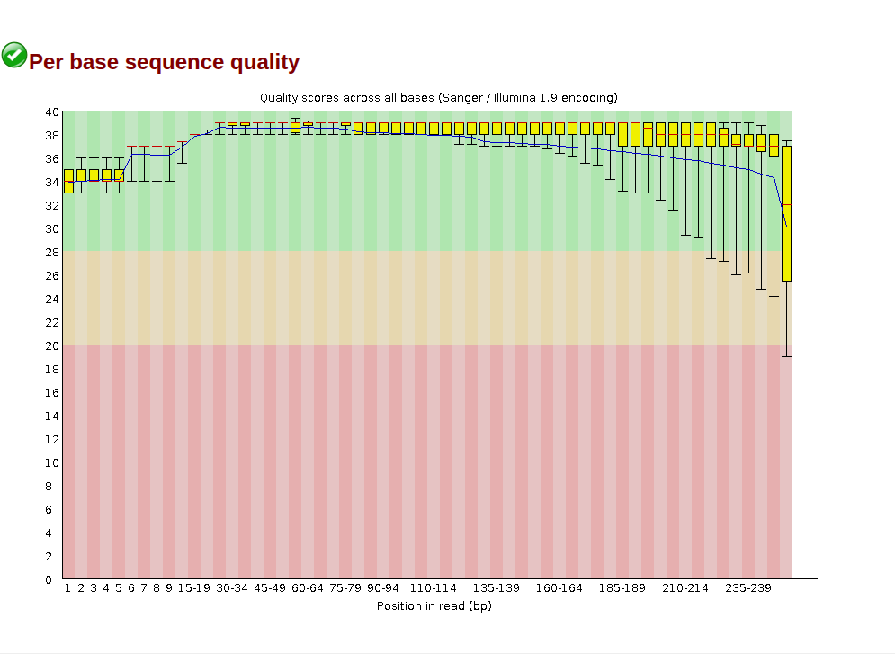

**Figura 10.** *Per base sequence quality de S11 R1 (datos crudos).*

R1 se mantiene en la zona verde (calidad buena) durante casi toda la lectura. La calidad recién empieza a bajar hacia el final (después de la posición ~230), entrando brevemente en zona amarilla/roja en las últimas bases, algo típico del final de una lectura Illumina.

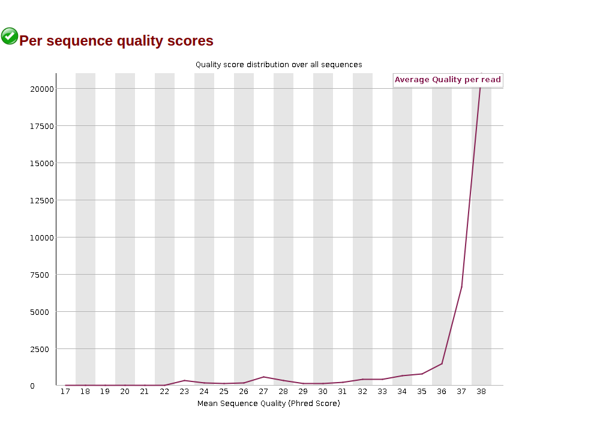

**Figura 11.** *Per sequence quality scores de S11 R1 (datos crudos).*

La gran mayoría de las lecturas de R1 se concentran en un score promedio de 37-38, con muy pocas lecturas de calidad más baja, lo que confirma una corrida de buena calidad para R1.

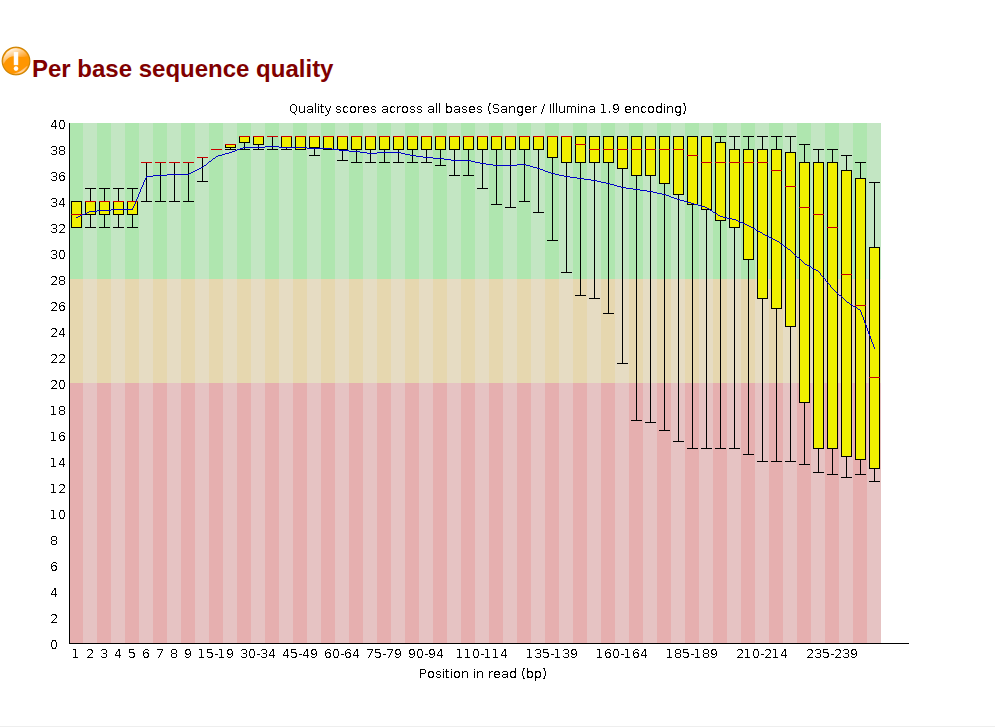

**Figura 12.** *Per base sequence quality de S11 R2 (datos crudos).*

R2 también parte y se mantiene mayormente en zona verde, pero la caída de calidad hacia el final de la lectura es más marcada que en R1 (consistente con el "Warning" que FastQC le asigna a este módulo para R2 y no para R1).

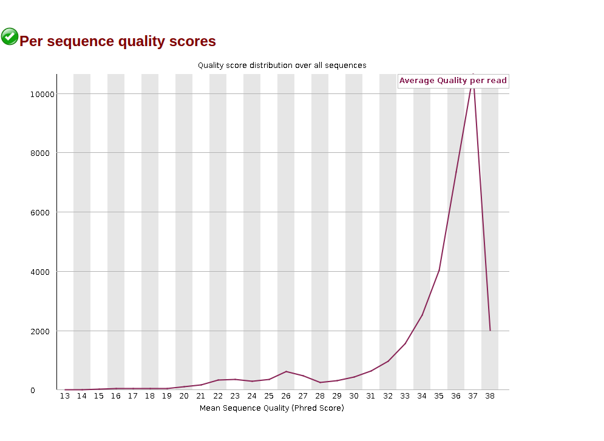

**Figura 13.** *Per sequence quality scores de S11 R2 (datos crudos).*

R2 también concentra sus lecturas en scores altos (37-38), de forma muy similar a R1, aunque con una cola algo más larga hacia scores más bajos.

##### Resultados — datos podados

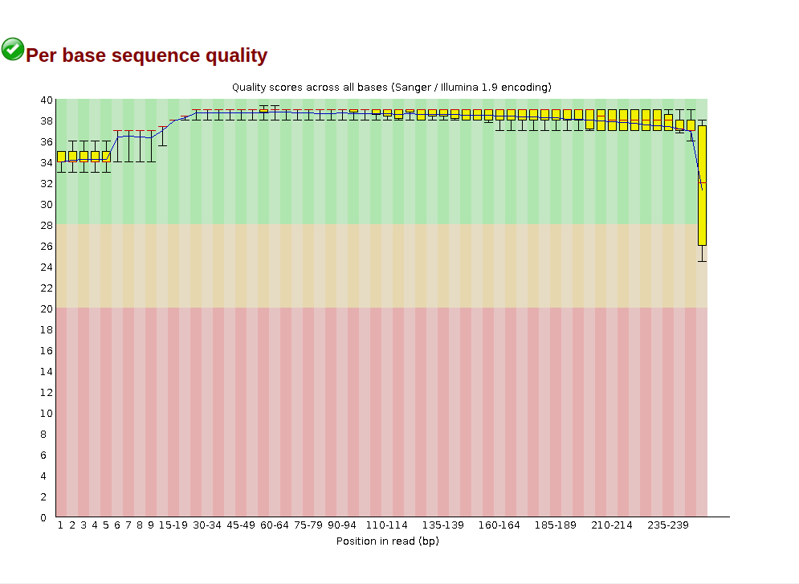

**Figura 15.** *Per base sequence quality de S11 R1 (datos podados).*

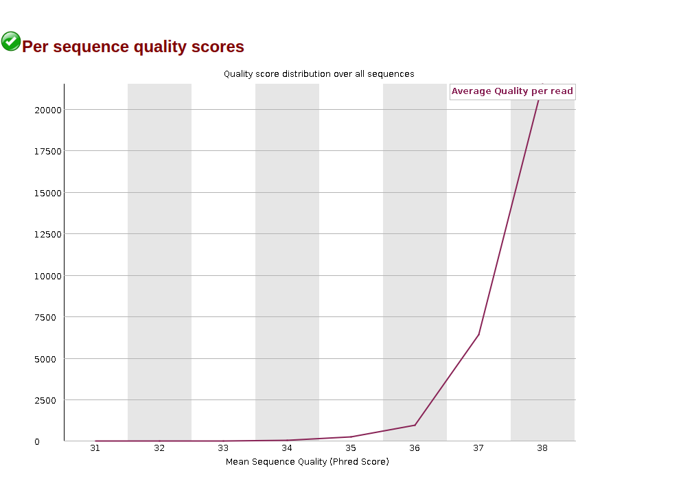

**Figura 16.** *Per sequence quality scores de S11 R1 (datos podados).*

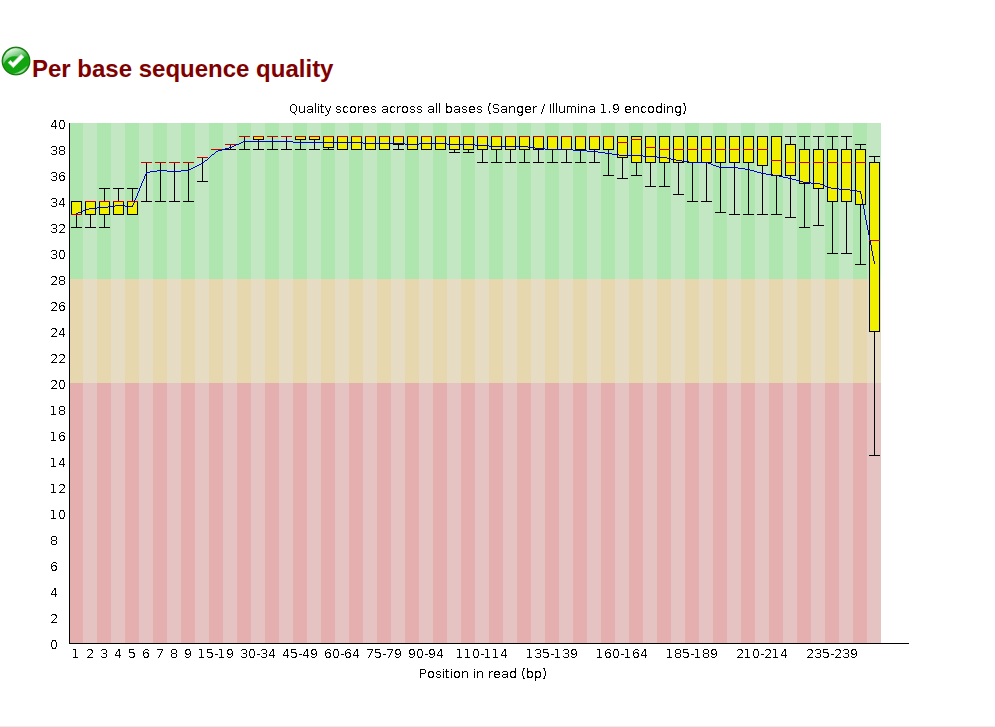

**Figura 17.** *Per base sequence quality de S11 R2 (datos podados).*

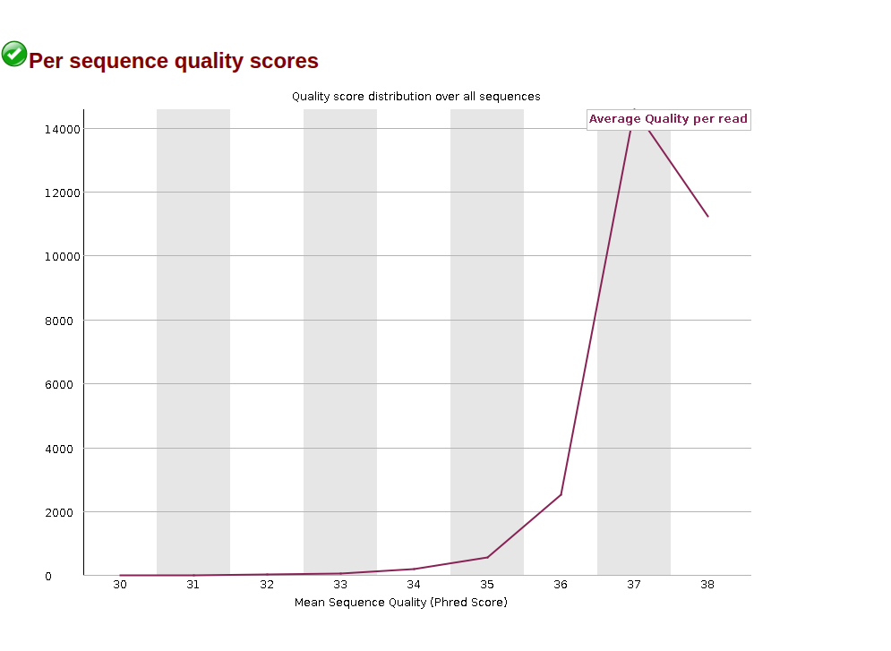

**Figura 18.** *Per sequence quality scores de S11 R2 (datos podados).*

##### Comparación crudas vs. podadas

| | R1 crudo | R1 podado | R2 crudo | R2 podado |
|---|---|---|---|---|
| Total Sequences | 33.757 | 29.240 | 33.757 | 29.240 |
| Sequence length | 251 (fija) | 36–251 (variable) | 251 (fija) | 35–251 (variable) |
| %GC | 45 | 45 | 45 | 44 |
| Per base sequence quality | Pass | Pass | Warning | Pass |

El podado eliminó 4.517 lecturas de las 33.757 originales (quedaron 29.240 en ambos R1 y R2), y pasó de un largo fijo de 251 pb a un largo variable (36–251 en R1, 35–251 en R2), esto es justamente lo que hace un programa de trimming, cortar las partes de mala calidad de cada lectura en vez de descartarla completa, dejando lecturas más cortas. En el gráfico de per-base quality, la caída de calidad que se veía al final de la lectura cruda es bastante menos marcada después de podar, y R2 pasa de "Warning" a "Pass" en ese módulo, lo que confirma que el paso de podado sí mejoró la calidad general de las lecturas.

#### Conclusión

Comparando R1 y R2, ambas lecturas son de buena calidad en general, con R2 levemente peor que R1 en las crudas, sobre todo hacia el final de la lectura, que es el patrón esperado en secuenciación pareada Illumina. El podado redujo el número de lecturas (de 33.757 a 29.240) y su largo pasó a ser variable, pero a cambio subió la calidad promedio, sobre todo en R2. Esto muestra el compromiso típico de cualquier paso de limpieza de datos NGS, se sacrifica algo de cantidad de datos para ganar calidad.


---

## Discusión

Esta tarea era básicamente mi primera vez haciendo control de calidad de datos NGS de principio a fin, y lo que más me quedó claro es que el control de calidad es la única forma de saber si los datos que vas a usar después sirven o no. Antes de este ejercicio yo me imaginaba que un archivo fastq era simplemente "la secuencia", y recién al ubicar la lectura 3 línea por línea entendí que cada read trae su propia información de calidad pegada, base por base, y que esa información es la que después usa cualquier programa de alineamiento o llamado de variantes para decidir en qué confiar y en qué no.

La comparación entre R1 y R2 me pareció el resultado más interesante de todos. Antes de ver los módulos de FastQC, no tenía ninguna razón para esperar que las dos lecturas de un mismo fragmento fueran distintas en calidad, pero R2 salió consistentemente peor que R1 en casi todos los indicadores (calidad por base, contenido por base, contenido de adaptadores). Investigando un poco entendí que esto es conocido y tiene que ver con cómo secuencia Illumina, R2 se lee después, cuando el fragmento ya lleva más tiempo expuesto en la celda de flujo y la señal se degrada más. Me sirvió para entender que "R1 y R2" no son dos copias iguales de la misma información, algo que hay que tener en cuenta al analizar datos pareados.

Lo mismo con la comparación entre datos crudos y podados, antes de correr FastQC sobre las secuencias filtradas, para mí "podar" las lecturas era solo un paso más del protocolo, sin pensar mucho en qué estaba sacrificando. Ver que se perdieron 4.517 lecturas (de 33.757 a 29.240) y que el largo pasó de ser fijo a variable, a cambio de que R2 pasara de "Warning" a "Pass" en calidad por base, me hizo ver ese paso como una decisión con un costo real: se gana calidad, pero se pierde una parte de los datos. No es gratis, y entender ese balance me parece importante antes de decidir qué tan agresivo conviene podar en un análisis real.

También quiero ser honesta,la lista de genes del panel me generó un poco de confusión, ya que el archivo `regiones_blanco.bed` no tiene una columna "gen" limpia, así que lo que iba contando cambiaba según qué tan a fondo procesara el texto de la columna 4 (369 regiones distintas, luego 52 valores al separar por ":", y recién contando a mano llegué a 27 genes realmente distintos). Prefiero dejar esas dos cosas marcadas así, tal como me fueron saliendo, en vez de pulirlas para que parezcan más ordenadas de lo que en realidad fueron.

En general, creo que el ejercicio cumplió su objetivo, aprender a leer un informe de FastQC con sentido crítico, no solo mirar si algo quedó en verde o en rojo, sino entender por qué, y poder respaldar con comandos propios los mismos números que entrega el programa.

## Conclusión general

Esta tarea cubrió todo el proceso de control de calidad de la muestra S11, desde explorar el fastq crudo a mano con comandos Unix (contar lecturas, identificar la lectura 3, traducir su calidad Phred, revisar el panel de genes), hasta generar el informe de FastQC para R1 y R2 y comparar sus resultados con lo calculado manualmente. Los números coincidieron exactamente entre ambos método.La muestra quedó con datos de buena calidad en general, con R2 algo más ruidosa que R1 (patrón típico de Illumina) y una mejora clara tras podar las secuencias, aunque a costa de perder 4.517 lecturas. En el camino tuve algunos errores,(como el error con scp y un par de cosas que no pude confirmar del todo como el conteo exacto de genes, que dejé señaladas mis conclusiones. 
